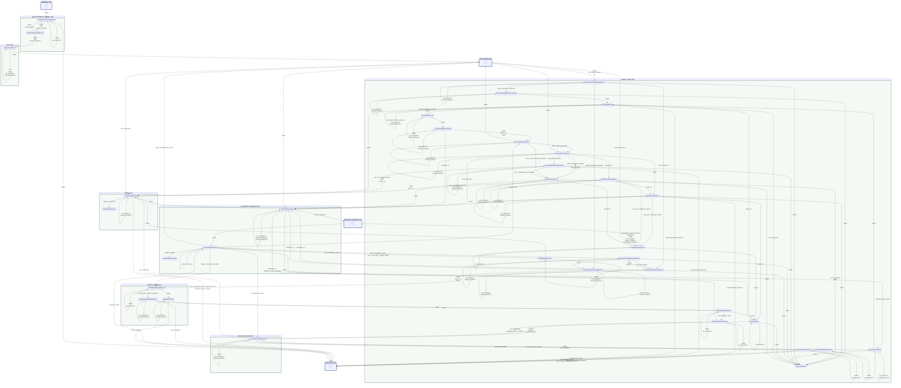

```mermaid
stateDiagram-v2
    state agent_performance_summary_abci {
        FetchPerformanceDataRound --> FetchPerformanceDataRound: <center>NONE<br />NO_MAJORITY</center>
        FetchPerformanceDataRound --> UpdateAchievementsRound: <center>DONE<br />FAIL<br />ROUND_TIMEOUT</center>
        UpdateAchievementsRound --> FetchPerformanceDataRound: <center>NONE<br />NO_MAJORITY</center>
    }
    state chatui_abci {
        ChatuiLoadRound --> ChatuiLoadRound: <center>FAIL<br />NONE<br />NO_MAJORITY<br />ROUND_TIMEOUT</center>
    }
    state check_stop_trading_abci {
        CheckStopTradingRound --> CheckStopTradingRound: <center>NONE<br />NO_MAJORITY<br />ROUND_TIMEOUT</center>
    }
    state decision_maker_abci {
        BenchmarkingRandomnessRound --> BenchmarkingRandomnessRound: <center>NO_MAJORITY<br />ROUND_TIMEOUT</center>
        BenchmarkingRandomnessRound --> ImpossibleRound: <center>NONE</center>
        BenchmarkingRandomnessRound --> SamplingRound: <center>DONE</center>
        BetPlacementRound --> BetPlacementRound: <center>NO_MAJORITY<br />ROUND_TIMEOUT</center>
        BetPlacementRound --> HandleFailedTxRound: <center>CALC_BUY_AMOUNT_FAILED</center>
        BetPlacementRound --> ImpossibleRound: <center>NONE</center>
        BetPlacementRound --> RedeemRound: <center>MOCK_TX</center>
        BlacklistingRound --> BlacklistingRound: <center>NO_MAJORITY<br />ROUND_TIMEOUT</center>
        BlacklistingRound --> ImpossibleRound: <center>FETCH_ERROR<br />NONE</center>
        CheckBenchmarkingModeRound --> BenchmarkingRandomnessRound: <center>BENCHMARKING_ENABLED</center>
        CheckBenchmarkingModeRound --> CheckBenchmarkingModeRound: <center>NO_MAJORITY<br />ROUND_TIMEOUT</center>
        CheckBenchmarkingModeRound --> ImpossibleRound: <center>NONE</center>
        CheckBenchmarkingModeRound --> PolymarketSetApprovalRound: <center>SET_APPROVAL</center>
        CheckBenchmarkingModeRound --> PolymarketWrapCollateralRound: <center>BENCHMARKING_DISABLED</center>
        DecisionReceiveRound --> BetPlacementRound: <center>DONE</center>
        DecisionReceiveRound --> BlacklistingRound: <center>MECH_RESPONSE_ERROR<br />TIE<br />UNPROFITABLE</center>
        DecisionReceiveRound --> DecisionReceiveRound: <center>NO_MAJORITY<br />ROUND_TIMEOUT</center>
        DecisionReceiveRound --> PolymarketBetPlacementRound: <center>POLYMARKET_DONE</center>
        DecisionReceiveRound --> SellOutcomeTokensRound: <center>DONE_SELL</center>
        DecisionRequestRound --> BlacklistingRound: <center>SLOTS_UNSUPPORTED_ERROR</center>
        DecisionRequestRound --> DecisionReceiveRound: <center>MOCK_MECH_REQUEST</center>
        DecisionRequestRound --> DecisionRequestRound: <center>NO_MAJORITY<br />ROUND_TIMEOUT</center>
        HandleFailedTxRound --> BlacklistingRound: <center>BLACKLIST</center>
        HandleFailedTxRound --> HandleFailedTxRound: <center>NO_MAJORITY</center>
        HandleFailedTxRound --> RedeemRound: <center>NO_OP</center>
        OmenWithdrawRound --> OmenWithdrawRound: <center>NONE<br />NO_MAJORITY</center>
        PolymarketBetPlacementRound --> BlacklistingRound: <center>BET_PLACEMENT_IMPOSSIBLE</center>
        PolymarketBetPlacementRound --> ImpossibleRound: <center>NONE</center>
        PolymarketBetPlacementRound --> PolymarketBetPlacementRound: <center>BET_PLACEMENT_FAILED<br />NO_MAJORITY<br />ROUND_TIMEOUT</center>
        PolymarketPostSetApprovalRound --> ImpossibleRound: <center>NONE</center>
        PolymarketPostSetApprovalRound --> PolymarketPostSetApprovalRound: <center>NO_MAJORITY<br />ROUND_TIMEOUT</center>
        PolymarketPostSetApprovalRound --> PolymarketSetApprovalRound: <center>APPROVAL_FAILED</center>
        PolymarketPostSetApprovalRound --> PolymarketWrapCollateralRound: <center>DONE</center>
        PolymarketRedeemRound --> PolymarketRedeemRound: <center>NONE<br />NO_MAJORITY</center>
        PolymarketSetApprovalRound --> ImpossibleRound: <center>NONE</center>
        PolymarketSetApprovalRound --> PolymarketPostSetApprovalRound: <center>DONE<br />MOCK_TX</center>
        PolymarketSetApprovalRound --> PolymarketSetApprovalRound: <center>NO_MAJORITY<br />ROUND_TIMEOUT</center>
        PolymarketSwapUsdcRound --> DecisionRequestRound: <center>DONE<br />MOCK_TX<br />NONE</center>
        PolymarketSwapUsdcRound --> PolymarketSwapUsdcRound: <center>NO_MAJORITY<br />ROUND_TIMEOUT</center>
        PolymarketWithdrawRound --> PolymarketWithdrawRound: <center>NONE<br />NO_MAJORITY</center>
        PolymarketWrapCollateralRound --> PolymarketWrapCollateralRound: <center>NO_MAJORITY<br />ROUND_TIMEOUT</center>
        PostBetUpdateRound --> PostBetUpdateRound: <center>NONE<br />NO_MAJORITY<br />ROUND_TIMEOUT</center>
        RandomnessRound --> ImpossibleRound: <center>NONE</center>
        RandomnessRound --> RandomnessRound: <center>NO_MAJORITY<br />ROUND_TIMEOUT</center>
        RandomnessRound --> SamplingRound: <center>DONE</center>
        RedeemRound --> ImpossibleRound: <center>NONE</center>
        RedeemRound --> RedeemRound: <center>NO_MAJORITY</center>
        RedeemRound --> SamplingRound: <center>MOCK_TX</center>
        RedeemRouterRound --> PolymarketRedeemRound: <center>POLYMARKET_DONE</center>
        RedeemRouterRound --> RedeemRound: <center>DONE</center>
        RedeemRouterRound --> RedeemRouterRound: <center>NONE<br />NO_MAJORITY</center>
        SamplingRound --> ImpossibleRound: <center>FETCH_ERROR</center>
        SamplingRound --> SamplingRound: <center>NEW_SIMULATED_RESAMPLE<br />NO_MAJORITY<br />ROUND_TIMEOUT</center>
        SamplingRound --> ToolSelectionRound: <center>BENCHMARKING_ENABLED<br />DONE</center>
        SellOutcomeTokensRound --> BetPlacementRound: <center>MOCK_TX</center>
        SellOutcomeTokensRound --> HandleFailedTxRound: <center>CALC_SELL_AMOUNT_FAILED</center>
        SellOutcomeTokensRound --> ImpossibleRound: <center>NONE</center>
        SellOutcomeTokensRound --> SellOutcomeTokensRound: <center>NO_MAJORITY<br />ROUND_TIMEOUT</center>
        ToolSelectionRound --> PolymarketSwapUsdcRound: <center>DONE</center>
        ToolSelectionRound --> ToolSelectionRound: <center>NONE<br />NO_MAJORITY<br />ROUND_TIMEOUT</center>
    }
    state market_manager_abci {
        FetchMarketsRouterRound --> FetchMarketsRouterRound: <center>NONE<br />NO_MAJORITY</center>
        FetchMarketsRouterRound --> PolymarketFetchMarketRound: <center>POLYMARKET_FETCH_MARKETS</center>
        FetchMarketsRouterRound --> UpdateBetsRound: <center>DONE</center>
        PolymarketFetchMarketRound --> PolymarketFetchMarketRound: <center>NO_MAJORITY<br />ROUND_TIMEOUT</center>
        UpdateBetsRound --> UpdateBetsRound: <center>NO_MAJORITY<br />ROUND_TIMEOUT</center>
    }
    state staking_abci {
        CallCheckpointRound --> CallCheckpointRound: <center>NO_MAJORITY<br />ROUND_TIMEOUT</center>
        CallCheckpointRound --> ServiceEvictedRound: <center>SERVICE_EVICTED</center>
    }
    state tx_settlement_multiplexer_abci {
        PostTxSettlementRound --> FailedMultiplexerRound: <center>UNRECOGNIZED</center>
        PostTxSettlementRound --> PostTxSettlementRound: <center>ROUND_TIMEOUT</center>
        PreTxSettlementRound --> PreTxSettlementRound: <center>NO_MAJORITY<br />REFILL_REQUIRED<br />ROUND_TIMEOUT</center>
    }
    state mech_interact_abci {
        state "..." as mech_interact_abci_collapsed
    }
    state registration_abci {
        state "..." as registration_abci_collapsed
    }
    state reset_pause_abci {
        state "..." as reset_pause_abci_collapsed
    }
    state transaction_settlement_abci {
        state "..." as transaction_settlement_abci_collapsed
    }
    registration_abci --> FetchPerformanceDataRound: <center>DONE</center>
    BetPlacementRound --> PreTxSettlementRound: <center>DONE</center>
    BetPlacementRound --> reset_pause_abci: <center>INSUFFICIENT_BALANCE</center>
    BlacklistingRound --> CallCheckpointRound: <center>DONE<br />MOCK_TX</center>
    CallCheckpointRound --> PreTxSettlementRound: <center>DONE</center>
    CallCheckpointRound --> reset_pause_abci: <center>NEXT_CHECKPOINT_NOT_REACHED_YET<br />SERVICE_NOT_STAKED</center>
    ChatuiLoadRound --> mech_interact_abci: <center>DONE</center>
    transaction_settlement_abci --> PostTxSettlementRound: <center>DONE</center>
    transaction_settlement_abci --> HandleFailedTxRound: <center>INCORRECT_SERIALIZATION<br />NEGATIVE<br />NONE<br />NO_MAJORITY<br />RESET_TIMEOUT<br />SUSPICIOUS_ACTIVITY</center>
    CheckStopTradingRound --> RandomnessRound: <center>DONE<br />REVIEW_BETS</center>
    CheckStopTradingRound --> CallCheckpointRound: <center>SKIP_TRADING</center>
    CheckStopTradingRound --> OmenWithdrawRound: <center>WITHDRAW_OMEN</center>
    CheckStopTradingRound --> PolymarketWithdrawRound: <center>WITHDRAW_POLYMARKET</center>
    DecisionReceiveRound --> PreTxSettlementRound: <center>DONE_NO_SELL</center>
    DecisionRequestRound --> mech_interact_abci: <center>DONE</center>
    mech_interact_abci --> CheckBenchmarkingModeRound: <center>DONE<br />NO_MARKETPLACE<br />V1</center>
    mech_interact_abci --> PreTxSettlementRound: <center>DONE</center>
    mech_interact_abci --> CallCheckpointRound: <center>SKIP_REQUEST</center>
    mech_interact_abci --> DecisionReceiveRound: <center>DONE</center>
    mech_interact_abci --> HandleFailedTxRound: <center>ROUND_TIMEOUT</center>
    OmenWithdrawRound --> reset_pause_abci: <center>WITHDRAWAL_DONE<br />WITHDRAWAL_ROUND_TIMEOUT</center>
    PolymarketBetPlacementRound --> CallCheckpointRound: <center>BET_PLACEMENT_DONE<br />DONE<br />MOCK_TX</center>
    PolymarketBetPlacementRound --> reset_pause_abci: <center>INSUFFICIENT_BALANCE</center>
    PolymarketFetchMarketRound --> RedeemRouterRound: <center>DONE</center>
    PolymarketFetchMarketRound --> reset_pause_abci: <center>FETCH_ERROR</center>
    PolymarketRedeemRound --> CheckStopTradingRound: <center>DONE<br />MOCK_TX<br />NO_REDEEMING</center>
    PolymarketRedeemRound --> PreTxSettlementRound: <center>PREPARE_TX<br />REDEEM_ROUND_TIMEOUT</center>
    PolymarketSetApprovalRound --> PreTxSettlementRound: <center>PREPARE_TX</center>
    PolymarketSwapUsdcRound --> PreTxSettlementRound: <center>PREPARE_TX</center>
    PolymarketWithdrawRound --> reset_pause_abci: <center>WITHDRAWAL_DONE<br />WITHDRAWAL_ROUND_TIMEOUT</center>
    PolymarketWrapCollateralRound --> FetchMarketsRouterRound: <center>DONE<br />MOCK_TX<br />NONE</center>
    PolymarketWrapCollateralRound --> PreTxSettlementRound: <center>PREPARE_TX</center>
    PostBetUpdateRound --> CallCheckpointRound: <center>DONE</center>
    PostTxSettlementRound --> PostBetUpdateRound: <center>BET_PLACEMENT_DONE<br />SELL_OUTCOME_TOKENS_DONE</center>
    PostTxSettlementRound --> mech_interact_abci: <center>MECH_REQUESTING_DONE</center>
    PostTxSettlementRound --> CheckStopTradingRound: <center>REDEEMING_DONE</center>
    PostTxSettlementRound --> PolymarketPostSetApprovalRound: <center>SET_APPROVAL_DONE</center>
    PostTxSettlementRound --> reset_pause_abci: <center>STAKING_DONE</center>
    PostTxSettlementRound --> RandomnessRound: <center>SUBSCRIPTION_DONE</center>
    PostTxSettlementRound --> DecisionRequestRound: <center>SWAP_DONE</center>
    PostTxSettlementRound --> FetchMarketsRouterRound: <center>WRAP_COLLATERAL_DONE</center>
    PreTxSettlementRound --> transaction_settlement_abci: <center>CHECKS_PASSED</center>
    RedeemRound --> PreTxSettlementRound: <center>DONE</center>
    RedeemRound --> CheckStopTradingRound: <center>NO_REDEEMING<br />REDEEM_ROUND_TIMEOUT</center>
    reset_pause_abci --> FetchPerformanceDataRound: <center>DONE</center>
    SamplingRound --> reset_pause_abci: <center>BENCHMARKING_FINISHED</center>
    SamplingRound --> CallCheckpointRound: <center>NONE</center>
    SellOutcomeTokensRound --> PreTxSettlementRound: <center>DONE</center>
    UpdateAchievementsRound --> ChatuiLoadRound: <center>DONE<br />FAIL<br />ROUND_TIMEOUT</center>
    UpdateBetsRound --> RedeemRouterRound: <center>DONE</center>
    UpdateBetsRound --> reset_pause_abci: <center>FETCH_ERROR</center>
    classDef devGroup fill:#f5f9f5,stroke:#2e7d32,stroke-width:2px,font-weight:bold
    class agent_performance_summary_abci,chatui_abci,check_stop_trading_abci,decision_maker_abci,market_manager_abci,staking_abci,tx_settlement_multiplexer_abci devGroup
    classDef macro fill:#eef2ff,stroke:#1e3a8a,stroke-width:3px,font-weight:bold
    class mech_interact_abci,registration_abci,reset_pause_abci,transaction_settlement_abci macro
```
