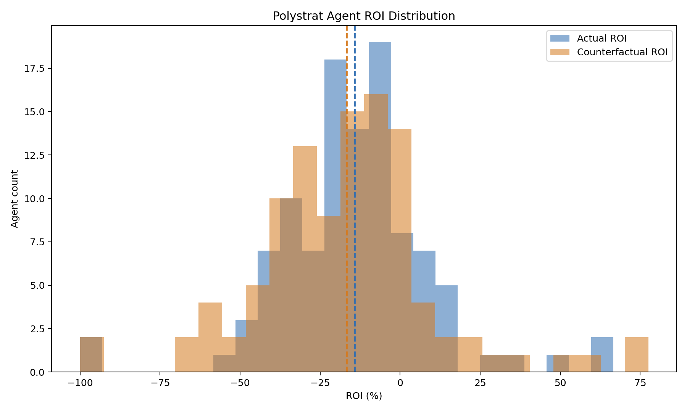
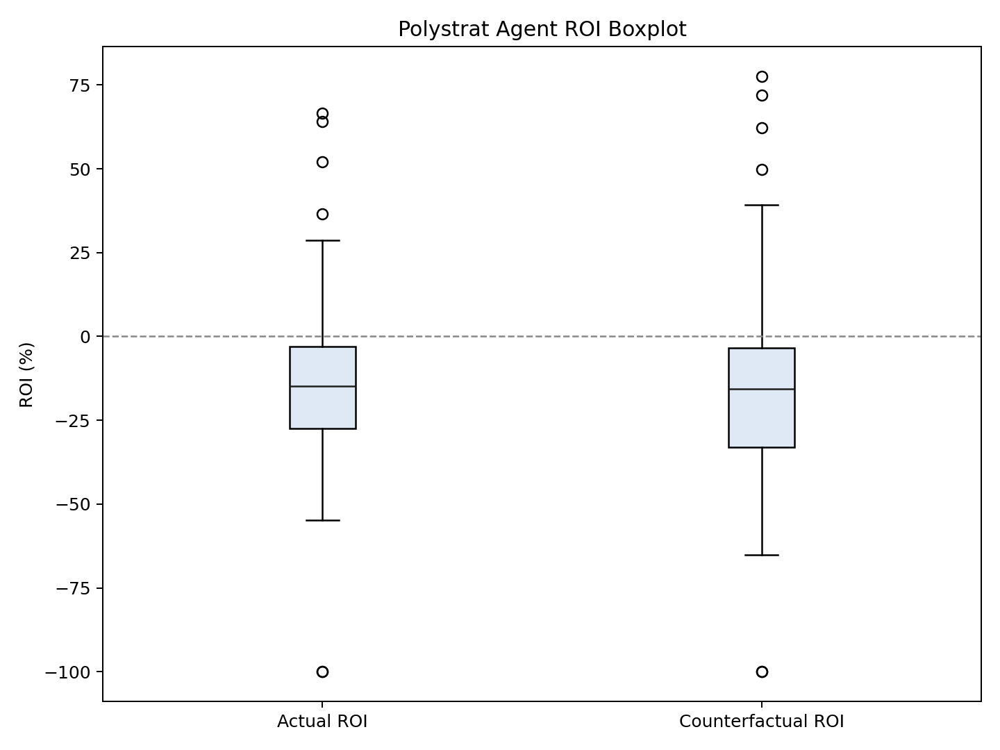
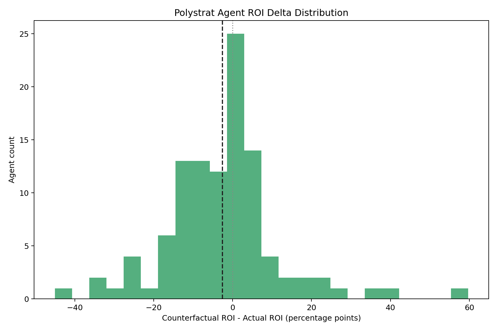
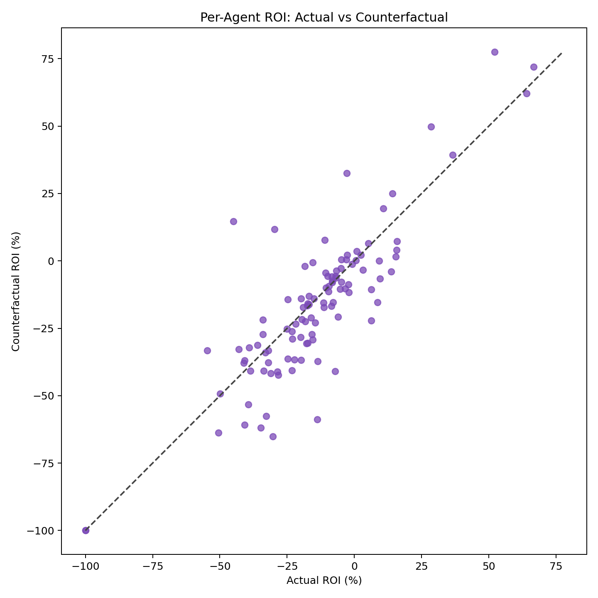

# Polystrat Kelly Replay Report

This folder stores the 2-week Polystrat replay for the UTC window from March 12, 2026 through March 26, 2026, using the same historical-approximation methodology as the earlier 4-day and 7-day reports.

## What is stored here

- `snapshot.json`: merged frozen dataset for the 2-week window.
- `params.json`: parameter set used for the replay.
- `replay.json`: replay output for the selected parameter set.
- `roi_distribution_summary.json`: summary statistics for the per-agent ROI distributions.
- `roi_histogram_overlay.png`: actual vs counterfactual agent ROI histogram.
- `roi_boxplot.png`: actual vs counterfactual agent ROI boxplot.
- `roi_delta_histogram.png`: per-agent ROI delta histogram.
- `roi_scatter.png`: actual vs counterfactual per-agent ROI scatter.

## How the test was produced

The 2-week dataset was fetched with the resumable chunked snapshot workflow:

```bash
python scripts/polystrat_kelly_chunked_snapshot.py \
  --all-agents \
  --start-date 2026-03-12 \
  --end-date 2026-03-26 \
  --chunk-days 7 \
  --chunks-dir /tmp/polystrat_2week_chunks \
  --output-snapshot /tmp/polystrat_snapshot_2026-03-12_2026-03-26.json \
  --output /tmp/polystrat_replay_2026-03-12_2026-03-26.json \
  --bankroll-usdc 15.0 \
  --floor-balance-usdc 0.0 \
  --min-bet-usdc 1.0 \
  --max-bet-usdc 2.5 \
  --n-bets 1 \
  --min-edge 0.01 \
  --min-oracle-prob 0.1 \
  --fee-per-trade-usdc 0.0 \
  --mech-fee-usdc 0.01 \
  --grid-points 500
```

The collection completed in three chunk files:

- `2026-03-12` to `2026-03-18`
- `2026-03-19` to `2026-03-25`
- `2026-03-26` to `2026-03-26`

The job timed out during one run on the final single-day chunk, but the resumable chunk checkpoints were preserved and the command eventually completed successfully, writing both the merged `snapshot.json` and `replay.json`.

## Data audit

Merged dataset integrity:

- Window: `2026-03-12T00:00:00+00:00` to `2026-03-26T23:59:59+00:00`
- Agent count: `107`
- Closed bet count: `3297`
- Replay rows: `3297`

Placed-bet counts by UTC day:

- `2026-03-12`: `344`
- `2026-03-13`: `241`
- `2026-03-14`: `233`
- `2026-03-15`: `361`
- `2026-03-16`: `425`
- `2026-03-17`: `390`
- `2026-03-18`: `131`
- `2026-03-19`: `126`
- `2026-03-20`: `200`
- `2026-03-21`: `296`
- `2026-03-22`: `234`
- `2026-03-23`: `277`
- `2026-03-24`: `23`
- `2026-03-25`: `16`

Coverage note:

- The dataset is dense from `2026-03-12` through `2026-03-23`, then becomes very thin on `2026-03-24` and `2026-03-25`.
- Even with that thin tail, the 2-week sample is materially broader than the earlier 4-day and 7-day windows and is useful as a more stable validation slice.

## Data sources

- Polymarket agents subgraph: `https://predict-polymarket-agents.subgraph.autonolas.tech/`
- Polygon mech subgraph: `https://api.subgraph.autonolas.tech/api/proxy/marketplace-polygon`

## Important assumptions

- We do not reconstruct full historical CLOB books.
- The replay uses realized execution price from the historical fill as the execution proxy.
- We do not have the historical CLOB `min_order_size` / `min_order_shares` value for each trade.
- For that reason, this replay does not enforce a reconstructed historical minimum-share gate.
- Instead, the practical lower bound in this replay is the strategy minimum bet size, set here to `1.0` USDC.
- Given that the tested sizing is bounded between `1.0` and `2.5` USDC, this is a reasonable approximation for this pre-prod comparison, even though it is not a perfect reconstruction of the venue constraint.

## Selected configuration

```json
{
  "bankroll_usdc": 15.0,
  "floor_balance_usdc": 0.0,
  "min_bet_usdc": 1.0,
  "max_bet_usdc": 2.5,
  "n_bets": 1,
  "min_edge": 0.01,
  "min_oracle_prob": 0.1,
  "fee_per_trade_usdc": 0.0,
  "mech_fee_usdc": 0.01,
  "grid_points": 500
}
```

## Aggregate results

Replay universe:

- 3297 closed bets
- 107 agents in the merged snapshot metadata
- 2364 counterfactual bets taken

Portfolio results:

- Actual traded: `7763.722558` USDC
- Actual profit: `-883.100185` USDC
- Actual ROI: `-11.3266%`
- Counterfactual traded: `3689.214529` USDC
- Counterfactual profit: `-491.793530` USDC
- Counterfactual ROI: `-13.2457%`
- ROI delta: `-1.9191` percentage points

Interpretation:

- On this 2-week window, the selected new sizing still underperforms the actual historical behavior on ROI.
- It deploys substantially less capital, roughly `52.5%` less notional than the historical baseline.
- Dollar losses are smaller in absolute terms because of the lower exposure, but the realized ROI is still worse than the historical actual baseline.

## ROI distribution results

Per-agent ROI summary from `roi_distribution_summary.json`:

- Actual mean ROI: `-14.063%`
- Counterfactual mean ROI: `-16.632%`
- Mean ROI delta: `-2.568` percentage points
- Actual median ROI: `-14.771%`
- Counterfactual median ROI: `-15.666%`
- Median ROI delta: `-1.393` percentage points

Distribution tail notes:

- The 10th percentile worsened from `-39.358%` to `-42.355%`.
- The 90th percentile also moved down from `9.499%` to `7.246%`.
- So both the center and the upper tail are weaker under the counterfactual on this broader sample.

## Optimizer-intent result

This report also supports the separate question:

- under the replay assumptions,
- and using the same expected log-utility objective,
- is the new Kelly sizing usually choosing a better stake than the historical bet size?

The exported replay field `g_improvement` is still non-negative by construction, so by itself it only tells us whether the selected counterfactual improves on the no-trade baseline inside the optimizer.

For the 2-week window:

- rows with `g_improvement > 0`: `2364`
- rows with `g_improvement = 0`: `933`
- rows with `g_improvement < 0`: `0`

To answer the more useful question, we also compared the historical bet size directly against the counterfactual Kelly size under the same constrained replay model.

Direct old-vs-new log-utility comparison:

- comparable rows: `2581`
- new better: `2324` (`90.0%` of comparable rows)
- old better: `227` (`8.8%` of comparable rows)
- ties: `30` (`1.2%` of comparable rows)
- mean `G_new - G_old`: `+0.732884`
- excluded because historical bet is too large for the constrained `max_bet_usdc = 2.5` model: `705`
- excluded because `p_yes` is missing: `11`

Interpretation:

- on the rows that are comparable under the constrained replay model, the new sizing still wins most of the time on its own expected log-utility objective
- so the optimizer mechanics continue to look internally consistent on the 2-week sample
- the mismatch appears later: better modeled log-utility under the replay inputs still does not translate into better realized ROI on the broader validation window

This keeps the same high-level conclusion as the shorter windows:

- the optimizer appears to be doing the intended theoretical optimization most of the time
- but the realized backtest still suggests that probability quality, execution approximation, and other replay assumptions are not yet reliable enough for that theoretical advantage to show up consistently in realized outcomes

## Plots

Histogram overlay:



Boxplot:



ROI delta histogram:



Scatter:



## Quick conclusion

The 2-week sample strengthens the same conclusion suggested by the 7-day report. Under this replay approximation, the selected new sizing remains more conservative in capital deployment, but that capital reduction does not translate into better realized ROI on the broader validation window. This configuration is therefore still not supported as a production candidate by the longer-horizon realized-ROI evidence.
