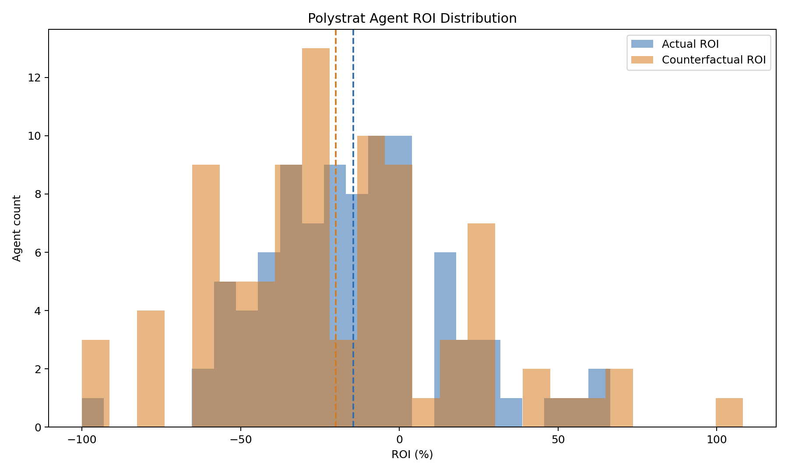
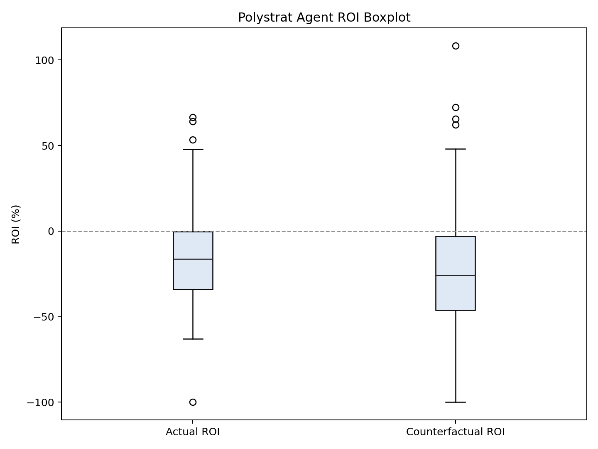
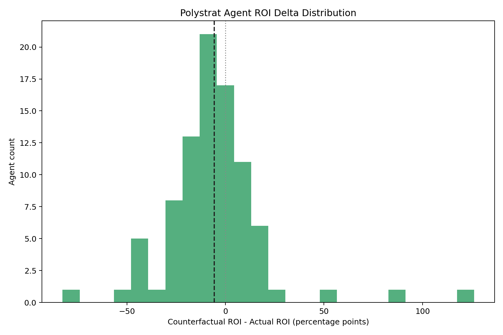
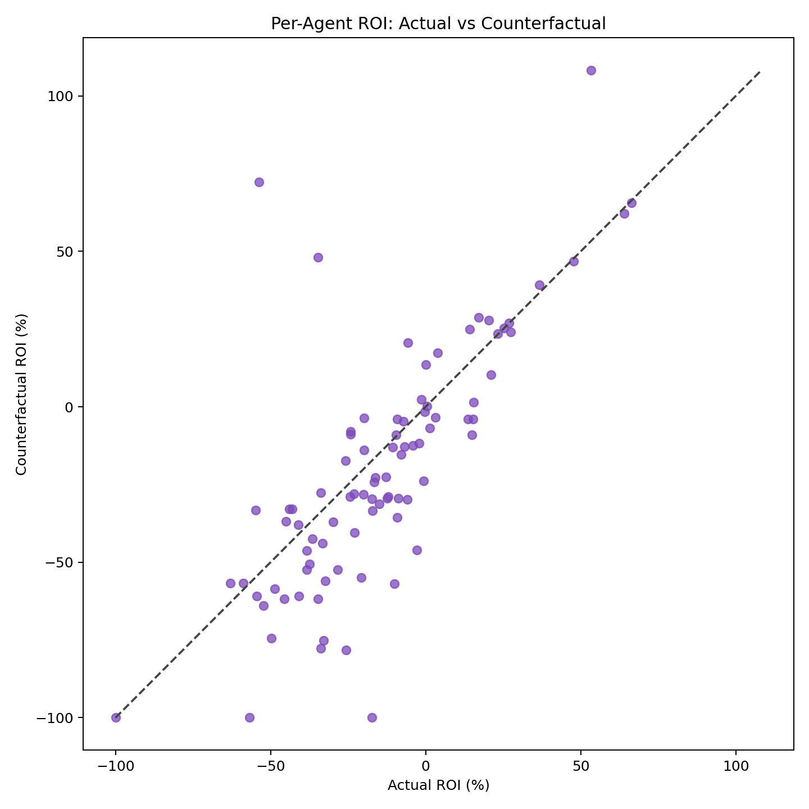

# Polystrat Kelly Replay Report

This folder stores the 7-day Polystrat replay for the UTC window from March 20, 2026 through March 26, 2026, using the same historical-approximation approach as the earlier 4-day report.

## What is stored here

- `snapshot.json`: merged frozen dataset for the 7-day window.
- `params.json`: parameter set used for the replay.
- `replay.json`: replay output for the selected parameter set.
- `roi_distribution_summary.json`: summary statistics for the per-agent ROI distributions.
- `roi_histogram_overlay.png`: actual vs counterfactual agent ROI histogram.
- `roi_boxplot.png`: actual vs counterfactual agent ROI boxplot.
- `roi_delta_histogram.png`: per-agent ROI delta histogram.
- `roi_scatter.png`: actual vs counterfactual per-agent ROI scatter.

## How the test was produced

The 7-day dataset was fetched with the resumable chunked snapshot workflow:

```bash
python scripts/polystrat_kelly_chunked_snapshot.py \
  --all-agents \
  --start-date 2026-03-20 \
  --end-date 2026-03-26 \
  --chunk-days 4 \
  --chunks-dir /tmp/polystrat_7day_chunks \
  --output-snapshot /tmp/polystrat_snapshot_2026-03-20_2026-03-26.json \
  --output /tmp/polystrat_replay_2026-03-20_2026-03-26.json \
  --bankroll-usdc 15.0 \
  --floor-balance-usdc 0.0 \
  --min-bet-usdc 1.0 \
  --max-bet-usdc 2.5 \
  --n-bets 1 \
  --min-edge 0.01 \
  --min-oracle-prob 0.1 \
  --fee-per-trade-usdc 0.0 \
  --mech-fee-usdc 0.01 \
  --grid-points 500
```

The collection was completed in two chunk files:

- `2026-03-20` to `2026-03-23`
- `2026-03-24` to `2026-03-26`

The CLI failed after chunk completion but before writing the final merged outputs, so `snapshot.json` and `replay.json` in this folder were materialized locally from the fully completed chunk files using the same tested merge and replay helpers.

## Data audit

Chunk completeness:

- Chunk 1: `97/97` completed agents, `1006` saved bets
- Chunk 2: `97/97` completed agents, `39` saved bets

Merged dataset integrity:

- Window: `2026-03-20T00:00:00+00:00` to `2026-03-26T23:59:59+00:00`
- Agent count: `90`
- Closed bet count: `1045`
- Duplicate bet keys after merge: `0`
- Replay rows: `1045`

Placed-bet counts by UTC day:

- `2026-03-20`: `200`
- `2026-03-21`: `296`
- `2026-03-22`: `234`
- `2026-03-23`: `276`
- `2026-03-24`: `23`
- `2026-03-25`: `16`
- `2026-03-26`: `0`

Coverage note:

- The later part of the 7-day window is much thinner than `2026-03-20` through `2026-03-23`.
- The broad negative result is not driven only by those thin tail days, because the dense `2026-03-20` to `2026-03-23` slice also underperformed under the new sizing.

## Data sources

- Polymarket agents subgraph: `https://predict-polymarket-agents.subgraph.autonolas.tech/`
- Polygon mech subgraph: `https://api.subgraph.autonolas.tech/api/proxy/marketplace-polygon`

## Important assumptions

- We do not reconstruct full historical CLOB books.
- The replay uses realized execution price from the historical fill as the execution proxy.
- We do not have the historical CLOB `min_order_size` / `min_order_shares` value for each trade.
- For that reason, this replay does not enforce a reconstructed historical minimum-share gate.
- Instead, the practical lower bound in this replay is the strategy minimum bet size, set here to `1.0` USDC.
- Given that the tested sizing is bounded between `1.0` and `2.5` USDC, this is a reasonable approximation for this pre-prod comparison, even though it is not a perfect reconstruction of the venue constraint.

## Selected configuration

```json
{
  "bankroll_usdc": 15.0,
  "floor_balance_usdc": 0.0,
  "min_bet_usdc": 1.0,
  "max_bet_usdc": 2.5,
  "n_bets": 1,
  "min_edge": 0.01,
  "min_oracle_prob": 0.1,
  "fee_per_trade_usdc": 0.0,
  "mech_fee_usdc": 0.01,
  "grid_points": 500
}
```

## Aggregate results

Replay universe:

- 1045 closed bets
- 90 agents in the merged snapshot metadata
- 727 counterfactual bets taken

Portfolio results:

- Actual traded: `2515.407016` USDC
- Actual profit: `-381.406671` USDC
- Actual ROI: `-15.1001%`
- Counterfactual traded: `1085.532801` USDC
- Counterfactual profit: `-217.196461` USDC
- Counterfactual ROI: `-19.8752%`
- ROI delta: `-4.7751` percentage points

Interpretation:

- On this 7-day window, the selected new sizing underperformed the actual historical behavior on ROI.
- It did deploy much less capital, but the lower exposure did not translate into better ROI.
- This broader sample does not confirm the positive 4-day signal.

## ROI distribution results

Per-agent ROI summary from `roi_distribution_summary.json`:

- Actual mean ROI: `-14.479%`
- Counterfactual mean ROI: `-20.074%`
- Mean ROI delta: `-5.595` percentage points
- Actual median ROI: `-16.410%`
- Counterfactual median ROI: `-25.850%`
- Median ROI delta: `-6.545` percentage points

Distribution tail notes:

- The 10th percentile worsened from `-49.800%` to `-61.847%`.
- The 90th percentile improved from `21.150%` to `26.876%`.
- The center of the distribution moved in the wrong direction overall.

## Plots

Histogram overlay:



Boxplot:



ROI delta histogram:



Scatter:



## Quick conclusion

Under the same replay assumptions used in the 4-day report, the selected new sizing does not hold up on the 7-day window. The result is worse than actual historical ROI on both aggregate and per-agent distribution metrics, so this configuration is not yet supported as a production candidate by the broader sample.
