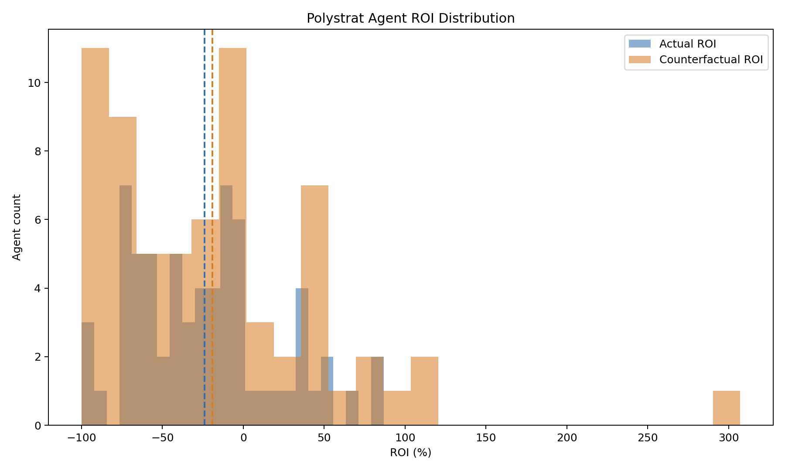
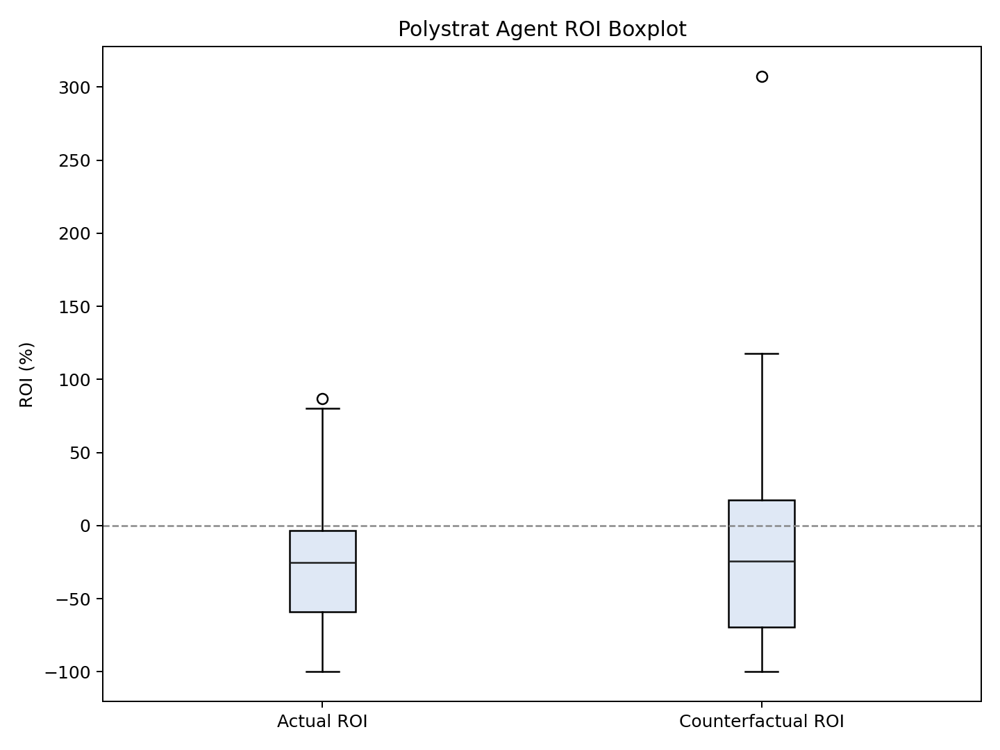
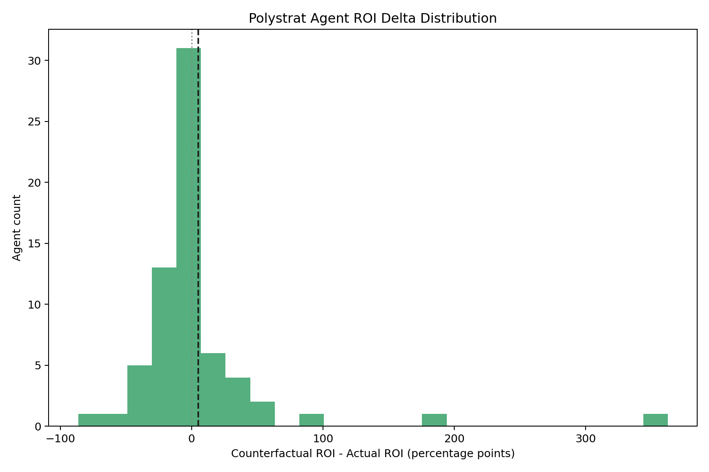
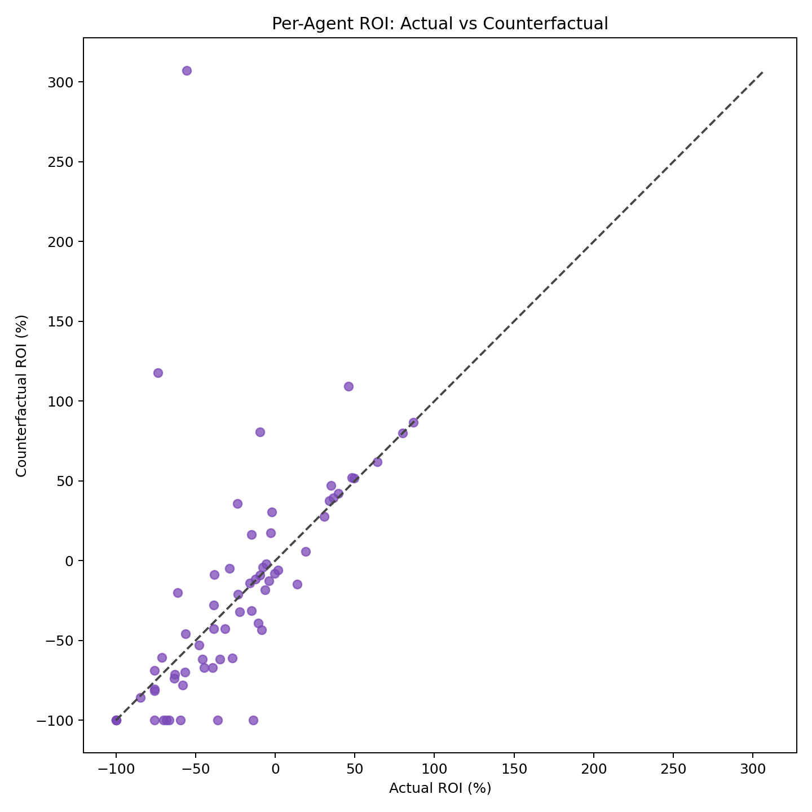

# Polystrat Kelly Replay Report

This folder stores a reproducible pre-production replay for Polystrat agents over the UTC window from March 23, 2026 through March 26, 2026.

## What is stored here

- `snapshot.json`: frozen enriched dataset for the replay window.
- `params_best_cluster.json`: parameter set used for the selected replay.
- `replay_best_cluster.json`: replay output for the selected parameter set.
- `roi_distribution_summary.json`: summary statistics for the per-agent ROI distributions.
- `roi_histogram_overlay.png`: actual vs counterfactual agent ROI histogram.
- `roi_boxplot.png`: actual vs counterfactual agent ROI boxplot.
- `roi_delta_histogram.png`: per-agent ROI delta histogram.
- `roi_scatter.png`: actual vs counterfactual per-agent ROI scatter.

## How the test was produced

The test was produced in two phases.

1. Freeze the historical window.

We first created a local snapshot for the target UTC window so later parameter retuning could reuse the same dataset without hitting the subgraphs again. The snapshot contains closed bets, bet sizes, payouts, realized execution price, and the mech probabilities needed to replay the Kelly sizing logic.

Command:

```bash
python scripts/polystrat_kelly_replay.py \
  --all-agents \
  --start-date 2026-03-23 \
  --end-date 2026-03-26 \
  --snapshot-output reports/polystrat_kelly_replay_2026-03-23_2026-03-26/snapshot.json \
  --output /tmp/polystrat_replay_live.json
```

Note:
- the live snapshot fetch timed out on the Polymarket agents subgraph during one rerun, so the committed `snapshot.json` was materialized from the fully completed replay dataset for the same window.
- its metadata `capture_version` is `v1-from-replay`.

2. Replay the selected parameter set offline from the frozen snapshot.

Command:

```bash
python scripts/polystrat_kelly_replay.py \
  --input-snapshot reports/polystrat_kelly_replay_2026-03-23_2026-03-26/snapshot.json \
  --bankroll-usdc 15.0 \
  --floor-balance-usdc 0.0 \
  --min-bet-usdc 1.0 \
  --max-bet-usdc 2.5 \
  --n-bets 1 \
  --min-edge 0.01 \
  --min-oracle-prob 0.1 \
  --fee-per-trade-usdc 0.0 \
  --mech-fee-usdc 0.01 \
  --grid-points 500 \
  --output reports/polystrat_kelly_replay_2026-03-23_2026-03-26/replay_best_cluster.json
```

3. Plot the agent ROI distributions from the replay output.

Command:

```bash
python scripts/plot_polystrat_roi_distributions.py \
  --input reports/polystrat_kelly_replay_2026-03-23_2026-03-26/replay_best_cluster.json \
  --output-dir reports/polystrat_kelly_replay_2026-03-23_2026-03-26
```

## Data sources

- Polymarket agents subgraph: `https://predict-polymarket-agents.subgraph.autonolas.tech/`
- Polygon mech subgraph: `https://api.subgraph.autonolas.tech/api/proxy/marketplace-polygon`

## Replay logic

For each closed Polystrat bet in the window, the replay:

- keeps only markets that are already closed,
- fetches the mech probability `p_yes` associated with the market,
- uses the realized execution price `amount / shares` as the historical execution proxy,
- computes actual realized net profit as `payout - bet - mech_fee`,
- reruns the new Kelly sizing logic with the selected parameters,
- estimates whether the counterfactual strategy would have taken the bet and what the estimated profit would have been,
- aggregates results at bet, agent, and portfolio level.

## Important assumptions

- We do not reconstruct full historical CLOB books.
- The replay uses realized execution price from the historical fill as the execution proxy.
- This makes the replay directionally useful for parameter comparison, but it is not a perfect historical market microstructure simulation.
- We also do not have the historical CLOB `min_order_size` / `min_order_shares` value for each trade.
- For that reason, this replay does not enforce a reconstructed historical minimum-share gate.
- Instead, the practical lower bound in this replay is the strategy minimum bet size, set here to `1.0` USDC.
- Given that the tested sizing is bounded between `1.0` and `2.5` USDC, this is a reasonable approximation for this pre-prod comparison, even though it is not a perfect reconstruction of the venue constraint.

## Selected configuration

The parameter set used for this report is:

```json
{
  "bankroll_usdc": 15.0,
  "floor_balance_usdc": 0.0,
  "min_bet_usdc": 1.0,
  "max_bet_usdc": 2.5,
  "n_bets": 1,
  "min_edge": 0.01,
  "min_oracle_prob": 0.1,
  "fee_per_trade_usdc": 0.0,
  "mech_fee_usdc": 0.01,
  "grid_points": 500
}
```

## Aggregate results

Replay universe:

- 315 closed bets
- 68 agents in the frozen snapshot metadata
- 243 counterfactual bets taken

Portfolio results:

- Actual traded: `769.328328` USDC
- Actual profit: `-206.267741` USDC
- Actual ROI: `-26.7021%`
- Counterfactual traded: `387.054003` USDC
- Counterfactual profit: `-75.519653` USDC
- Counterfactual ROI: `-19.3897%`
- ROI delta: `+7.3124` percentage points

Interpretation:

- The selected configuration improved ROI versus actual historical behavior on this frozen window.
- It also reduced deployed capital by about `49.7%`.
- Dollar losses were materially lower in the counterfactual replay.

## ROI distribution results

Per-agent ROI summary from `roi_distribution_summary.json`:

- Actual mean ROI: `-24.000%`
- Counterfactual mean ROI: `-18.977%`
- Mean ROI delta: `+5.023` percentage points
- Actual median ROI: `-25.333%`
- Counterfactual median ROI: `-24.314%`
- Median ROI delta: `-1.556` percentage points

Distribution tail notes:

- The 90th percentile improved from `36.613%` to `52.092%`.
- The 10th percentile worsened from `-75.680%` to `-100.000%`.
- So the center improved on average, but the downside tail still deserves attention.

## Plots

Histogram overlay:



Boxplot:



ROI delta histogram:



Scatter:



## Quick conclusion

For this specific week and this replay approximation, the most useful improvement came from controlling exposure with `n_bets = 1` and especially `max_bet_usdc = 2.5`. In this sample, `min_edge` and `min_oracle_prob` within the tested range had much less impact than the bet cap.
