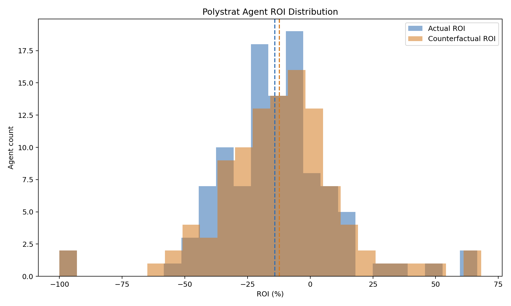
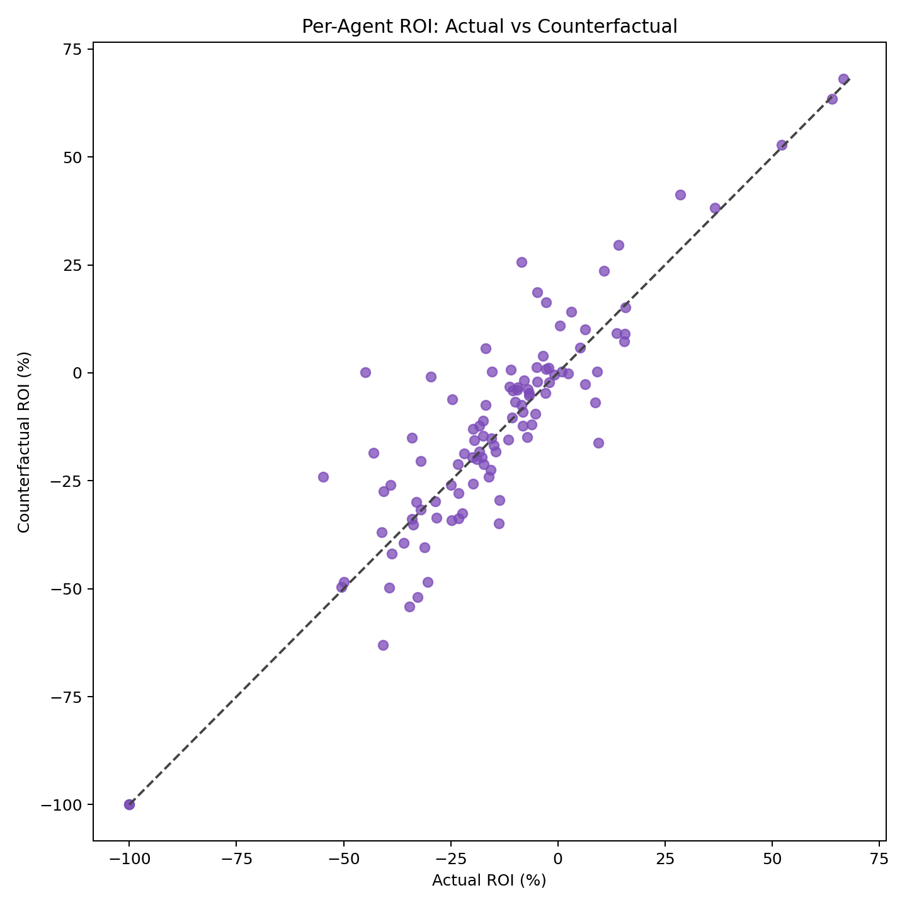
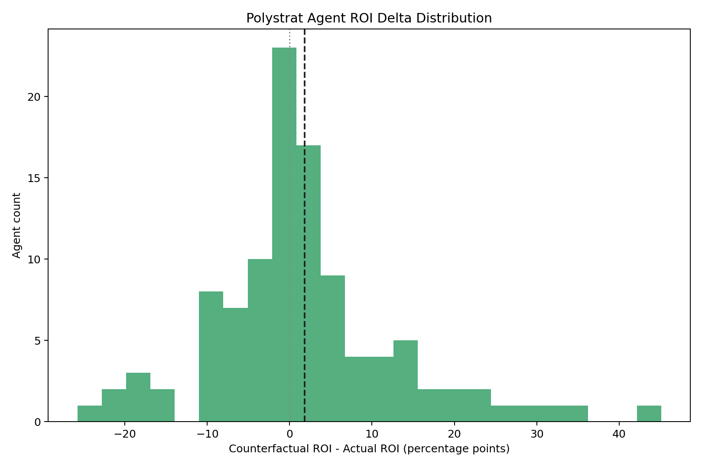
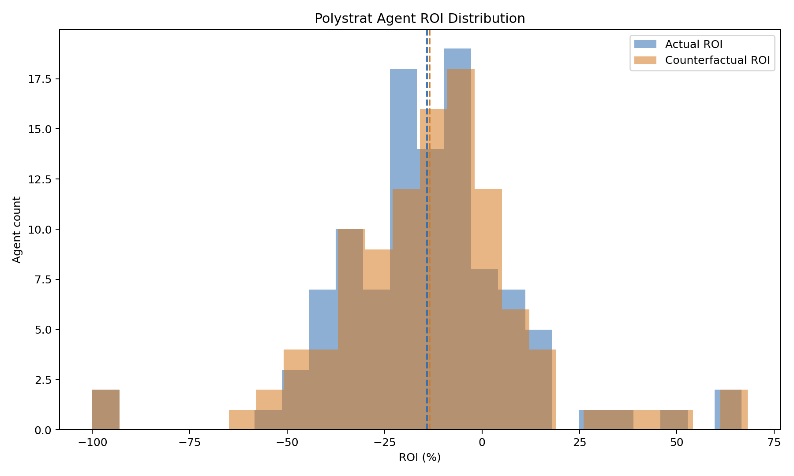
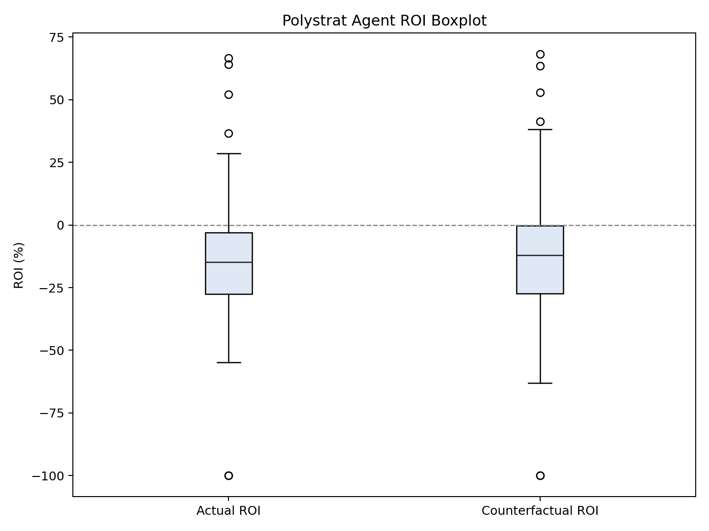
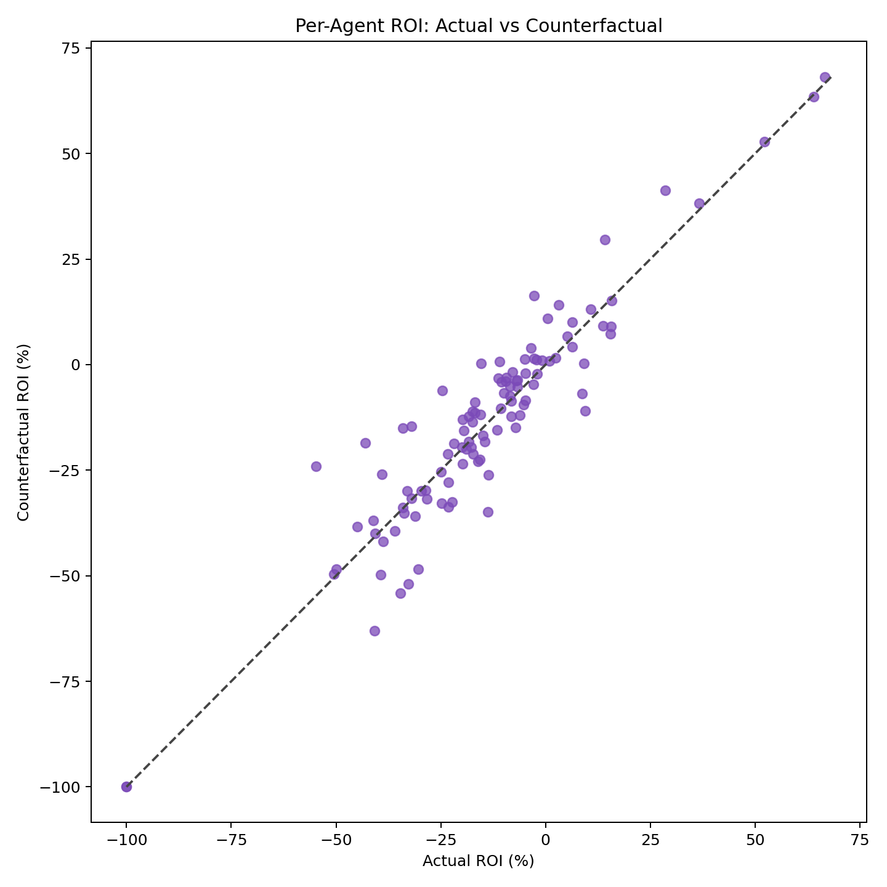
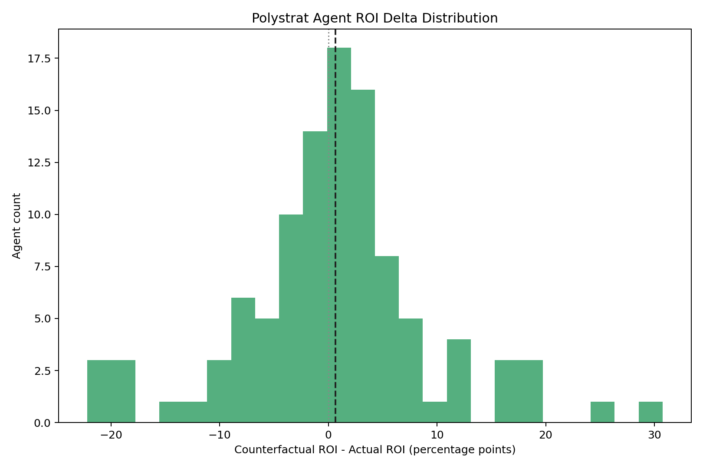
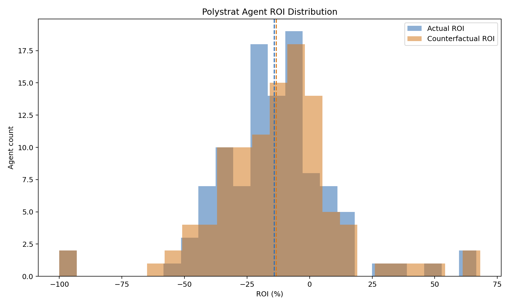
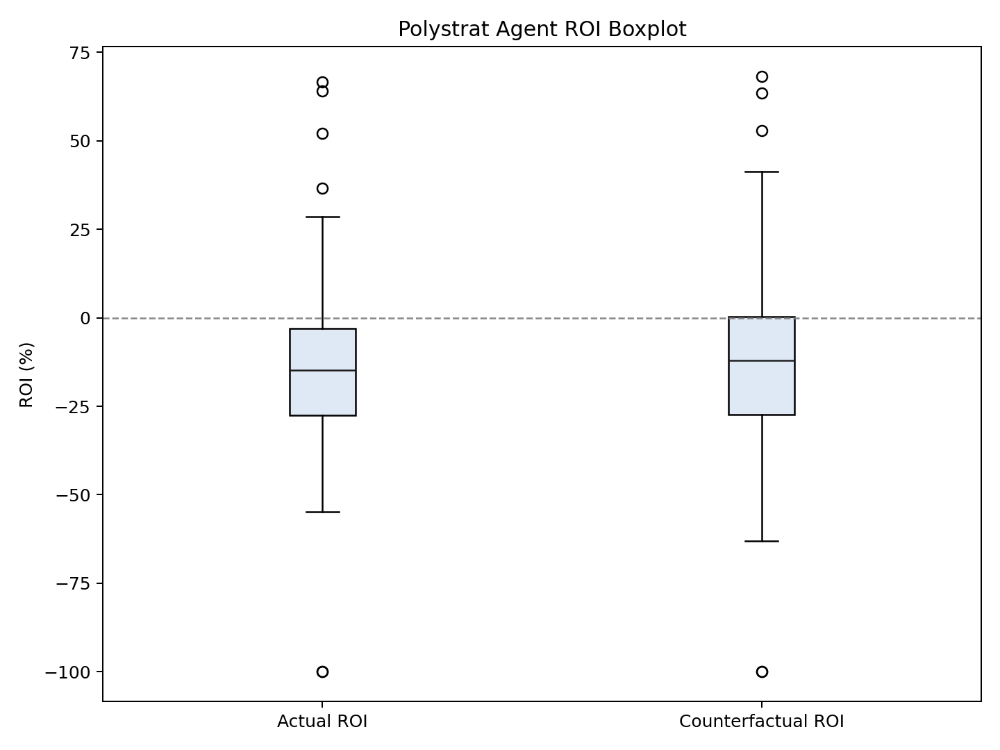
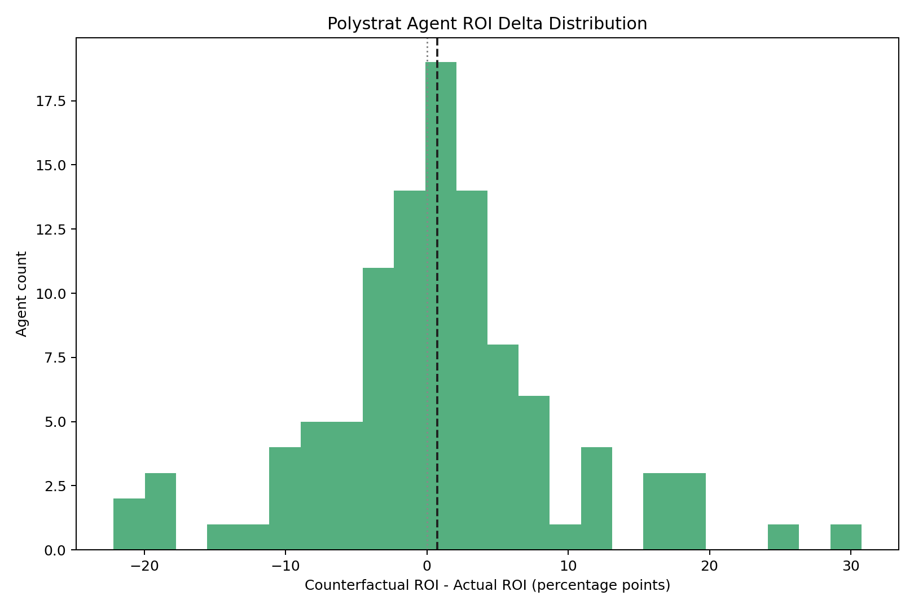

### Polystrat Kelly Replay v2 -- negRisk Segmentation

**Date:** 2026-03-26
**Window:** 2026-03-12 to 2026-03-26 (3297 closed bets, 435 unique markets, 107 agents)
**Source snapshot:** `polystrat_kelly_replay_2026-03-12_2026-03-26/snapshot.json` (v1-merged-3)
**Improvement over v1:** negRisk market tagging from CLOB API, segmented analysis,
min_oracle_prob sensitivity study

---

#### How this report was produced

**Phase 1: Reuse the v1 frozen snapshot.**

The v1 snapshot was collected from the live subgraphs (Polymarket agents + Polygon
mech marketplace) and contains 3297 closed bets with mech probabilities, realized
execution prices, and payout data. We reuse it to avoid re-fetching.

**Phase 2: Enrich with negRisk tags.**

For each of the 435 unique `condition_id` values, we queried the Polymarket CLOB
API (`GET /markets/{conditionId}`) and extracted the `neg_risk` boolean field.
This tags each bet as belonging to a multi-outcome range event (negRisk=True) or
a standalone binary market (negRisk=False).

```bash
python scripts/enrich_snapshot_neg_risk.py \
  --input reports/polystrat_kelly_replay_2026-03-12_2026-03-26/snapshot.json \
  --output reports/polystrat_kelly_replay_v2_2026-03-12_2026-03-26/snapshot_enriched.json
# Result: 2943 negRisk, 354 non-negRisk, 0 unknown
```

**Phase 3: Run replays at three min_oracle_prob settings.**

Each replay uses the actual `polystrat_kelly_replay.py` script with `--input-snapshot`:

```bash
# mop=0.1 (original v1 setting)
python scripts/polystrat_kelly_replay.py \
  --input-snapshot reports/polystrat_kelly_replay_2026-03-12_2026-03-26/snapshot.json \
  --bankroll-usdc 15.0 --floor-balance-usdc 0.0 \
  --min-bet-usdc 1.0 --max-bet-usdc 2.5 --n-bets 3 \
  --min-edge 0.01 --min-oracle-prob 0.1 \
  --fee-per-trade-usdc 0.0 --mech-fee-usdc 0.01 --grid-points 500 \
  --output reports/polystrat_kelly_replay_v2_2026-03-12_2026-03-26/replay_mop_01.json

# mop=0.3
python scripts/polystrat_kelly_replay.py \
  --input-snapshot reports/polystrat_kelly_replay_2026-03-12_2026-03-26/snapshot.json \
  --bankroll-usdc 15.0 --floor-balance-usdc 0.0 \
  --min-bet-usdc 1.0 --max-bet-usdc 2.5 --n-bets 3 \
  --min-edge 0.01 --min-oracle-prob 0.3 \
  --fee-per-trade-usdc 0.0 --mech-fee-usdc 0.01 --grid-points 500 \
  --output reports/polystrat_kelly_replay_v2_2026-03-12_2026-03-26/replay_mop_03.json

# mop=0.5 (production default)
python scripts/polystrat_kelly_replay.py \
  --input-snapshot reports/polystrat_kelly_replay_2026-03-12_2026-03-26/snapshot.json \
  --bankroll-usdc 15.0 --floor-balance-usdc 0.0 \
  --min-bet-usdc 1.0 --max-bet-usdc 2.5 --n-bets 3 \
  --min-edge 0.01 --min-oracle-prob 0.5 \
  --fee-per-trade-usdc 0.0 --mech-fee-usdc 0.01 --grid-points 500 \
  --output reports/polystrat_kelly_replay_v2_2026-03-12_2026-03-26/replay_mop_05.json
```

**Phase 4: Generate plots for each replay.**

```bash
for f in replay_mop_01 replay_mop_03 replay_mop_05; do
  python scripts/plot_polystrat_roi_distributions.py \
    --input reports/polystrat_kelly_replay_v2_2026-03-12_2026-03-26/${f}.json \
    --output-dir reports/polystrat_kelly_replay_v2_2026-03-12_2026-03-26/${f}_plots
done
```

**Phase 5: Segment replay outputs by negRisk.**

```bash
for f in replay_mop_01 replay_mop_03 replay_mop_05; do
  python scripts/segment_replay_by_neg_risk.py \
    --replay reports/polystrat_kelly_replay_v2_2026-03-12_2026-03-26/${f}.json \
    --enriched-snapshot reports/polystrat_kelly_replay_v2_2026-03-12_2026-03-26/snapshot_enriched.json \
    --output reports/polystrat_kelly_replay_v2_2026-03-12_2026-03-26/segmented_${f#replay_}.json
done
```

---

#### Data Sources

- Polymarket agents subgraph: `https://predict-polymarket-agents.subgraph.autonolas.tech/`
- Polygon mech subgraph: `https://api.subgraph.autonolas.tech/api/proxy/marketplace-polygon`
- Polymarket CLOB API: `https://clob.polymarket.com/markets/{conditionId}` (for negRisk tags)

---

#### Market Composition

| Category | Count | % |
|----------|-------|---|
| negRisk (multi-outcome range markets) | 2943 | 89.3% |
| Non-negRisk (standalone binary) | 354 | 10.7% |
| Total | 3297 | 100% |

negRisk markets include: stock price ranges (AAPL, AMZN, GOOGL, etc.), approval
rating ranges, temperature ranges, tweet count ranges, election seat ranges.

Non-negRisk markets include: standalone binary politics/sports/events questions.

---

#### Configuration (common to all replays)

| Parameter | Value |
|-----------|-------|
| bankroll | 15.0 USDC |
| floor_balance | 0.0 USDC |
| min_bet | 1.0 USDC |
| max_bet | 2.5 USDC |
| n_bets | 3 |
| min_edge | 0.01 |
| fee_per_trade | 0.0 USDC |
| mech_fee | 0.01 USDC |
| grid_points | 500 |

---

#### Results: negRisk-Segmented Replay Comparison

| mop | Segment | Bets | CF bets | YES | NO | Side sw. | Act. profit | CF profit | Act. ROI | CF ROI | Delta |
|-----|---------|------|---------|-----|----|----------|-------------|-----------|----------|--------|-------|
| 0.1 | all | 3297 | 2736 | 410 | 2326 | 56 | -883 | -574 | -11.3% | -9.2% | +2.1pp |
| 0.1 | negRisk | 2943 | 2427 | 296 | 2131 | 36 | -697 | -570 | -9.9% | -10.3% | -0.4pp |
| 0.1 | non-negRisk | 354 | 309 | 114 | 195 | 20 | -187 | -4 | -24.5% | **-0.6%** | **+23.9pp** |
| 0.3 | all | 3297 | 2691 | 373 | 2318 | 11 | -883 | -722 | -11.3% | -11.7% | -0.4pp |
| 0.3 | negRisk | 2943 | 2401 | 271 | 2130 | 10 | -697 | -568 | -9.9% | -10.3% | -0.4pp |
| 0.3 | non-negRisk | 354 | 290 | 102 | 188 | 1 | -187 | -154 | -24.5% | -22.6% | +1.9pp |
| 0.5 | all | 3297 | 2680 | 363 | 2317 | 0 | -883 | -726 | -11.3% | -11.8% | -0.5pp |
| 0.5 | negRisk | 2943 | 2391 | 262 | 2129 | 0 | -697 | -570 | -9.9% | -10.4% | -0.5pp |
| 0.5 | non-negRisk | 354 | 289 | 101 | 188 | 0 | -187 | -156 | -24.5% | -23.1% | +1.4pp |

**Column legend:**
- **mop** = min_oracle_prob setting
- **CF bets** = counterfactual bets Kelly would have placed
- **YES/NO** = counterfactual side breakdown
- **Side sw.** = bets where Kelly picks the opposite side from what was actually bet
- **Act./CF profit** = in USDC
- **Delta** = CF ROI minus Actual ROI in percentage points

---

#### Key Questions and Answers

**Q1: Is the new Kelly doing better on negRisk markets historically?**

**No.** Kelly is consistently worse on negRisk markets at every min_oracle_prob
setting (-0.4 to -0.5pp). The mech oracle has no exploitable edge on range
markets. Kelly correctly sizes bets, but there is nothing profitable to size into.

**Q2: Is Kelly doing better on non-negRisk markets? And does mop=0.5 help?**

**Yes, Kelly always improves non-negRisk ROI** (positive delta at every setting):

- mop=0.1: **+23.9pp** (20 side switches correct bad bets)
- mop=0.3: **+1.9pp** (1 side switch)
- mop=0.5: **+1.4pp** (0 side switches, improvement from bet sizing only)

Even at the production default (mop=0.5), Kelly improves by +1.4pp on standalone
binary markets. The improvement at 0.5 comes from **bet sizing** (Kelly bets less
on weak edges), not from side switching. At lower mop, the additional improvement
comes from **side switching** where Kelly corrects the trader's wrong-side bet.

---

#### Detailed Findings

**1. negRisk markets: Kelly does not improve ROI**

Across all min_oracle_prob settings, the Kelly criterion produces a slightly
**negative ROI delta** on negRisk markets (-0.4 to -0.5pp). The mech oracle does
not have exploitable edge on range-type markets. Kelly correctly sizes bets but
there is nothing to exploit.

**2. Non-negRisk markets: Kelly dramatically improves at mop=0.1**

On standalone binary markets, the counterfactual ROI at mop=0.1 is **-0.6%**
versus actual **-24.5%**, a +23.9pp improvement. This is driven by:
- 20 side switches where Kelly corrects the trader's wrong-side bet
- These corrections turn losses into near-breakeven
- Dollar losses drop from 187 USDC to just 4 USDC

**3. The improvement collapses at higher min_oracle_prob**

At mop=0.3, side switches drop to 1 and improvement drops to +1.9pp.
At mop=0.5 (production), side switches go to zero and improvement is +1.4pp.
The `min_oracle_prob` filter prevents Kelly from switching sides, which is
the primary source of value.

**4. negRisk is 89% of the bet universe**

Because negRisk markets dominate (2943 of 3297 bets), their -0.4pp delta
overwhelms the non-negRisk +23.9pp improvement in the aggregate view. This
is why the aggregate shows only +2.1pp at mop=0.1.

**5. All strategies are loss-making**

No configuration produces positive ROI. The best result is -0.6% on non-negRisk
at mop=0.1. The oracle (mech) does not have sufficient predictive edge to
overcome transaction costs on either market type.

---

#### Implication: Different min_oracle_prob for negRisk vs non-negRisk

The data suggests:
- **negRisk markets:** min_oracle_prob is irrelevant (Kelly doesn't help regardless)
- **Non-negRisk markets:** lower min_oracle_prob enables side switches that dramatically reduce losses

A split configuration could apply:
- mop=0.5 for negRisk (conservative, avoid uninformed range bets)
- mop=0.1 for non-negRisk (enable side-switching where oracle has signal)

This requires passing `neg_risk` to the Kelly criterion and applying different
filters per market type.

---

#### Methodology Limitations

1. **No historical orderbooks.** The replay uses the realized execution price
   (amount/shares) as the orderbook proxy. For counterfactual bets on the
   opposite side, the synthetic price is `1 - executed_price`, which understates
   the real bid-ask spread.
2. **Side switches are most affected.** The 56 side switches at mop=0.1 use the
   most aggressive price assumption (opposite side at `1 - fill`). Their
   counterfactual profit may be overstated.
3. **Fixed bankroll.** Each bet assumes 15 USDC regardless of cumulative P&L.
4. **Synthetic single-level orderbook.** The 500-point grid search degenerates
   into a flat-book evaluation.

---

#### Plots

##### min_oracle_prob = 0.1 (original v1 setting)






##### min_oracle_prob = 0.3






##### min_oracle_prob = 0.5 (production default)






---

#### Files

| File | Description |
|------|-------------|
| `snapshot_enriched.json` | 3297 bets with `is_neg_risk` tags from CLOB API |
| `replay_mop_01.json` | Full replay at min_oracle_prob=0.1 (3297 bets, per-agent summaries) |
| `replay_mop_03.json` | Full replay at min_oracle_prob=0.3 |
| `replay_mop_05.json` | Full replay at min_oracle_prob=0.5 (production) |
| `segmented_mop_01.json` | negRisk-segmented statistics for mop=0.1 |
| `segmented_mop_03.json` | negRisk-segmented statistics for mop=0.3 |
| `segmented_mop_05.json` | negRisk-segmented statistics for mop=0.5 |
| `replay_mop_01_plots/` | ROI distribution plots for mop=0.1 |
| `replay_mop_03_plots/` | ROI distribution plots for mop=0.3 |
| `replay_mop_05_plots/` | ROI distribution plots for mop=0.5 |
| `replay_comparison.json` | Side-by-side comparison of all three configs |
| `README.md` | This file |
