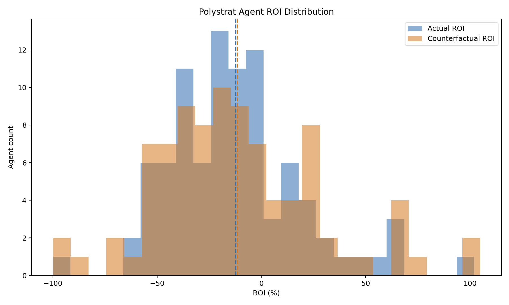
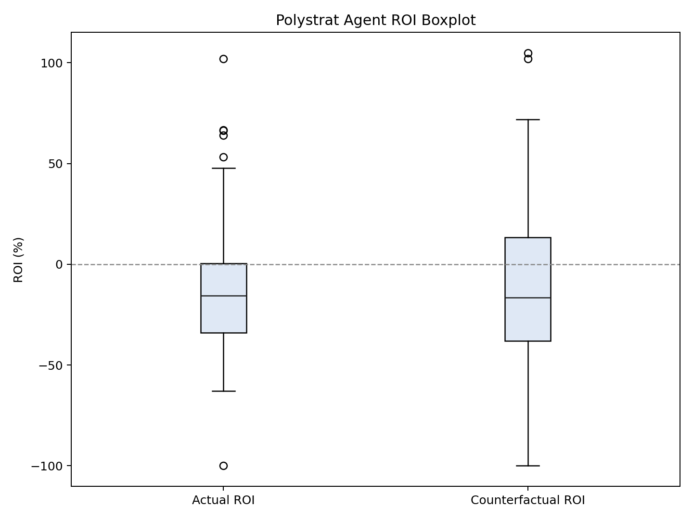
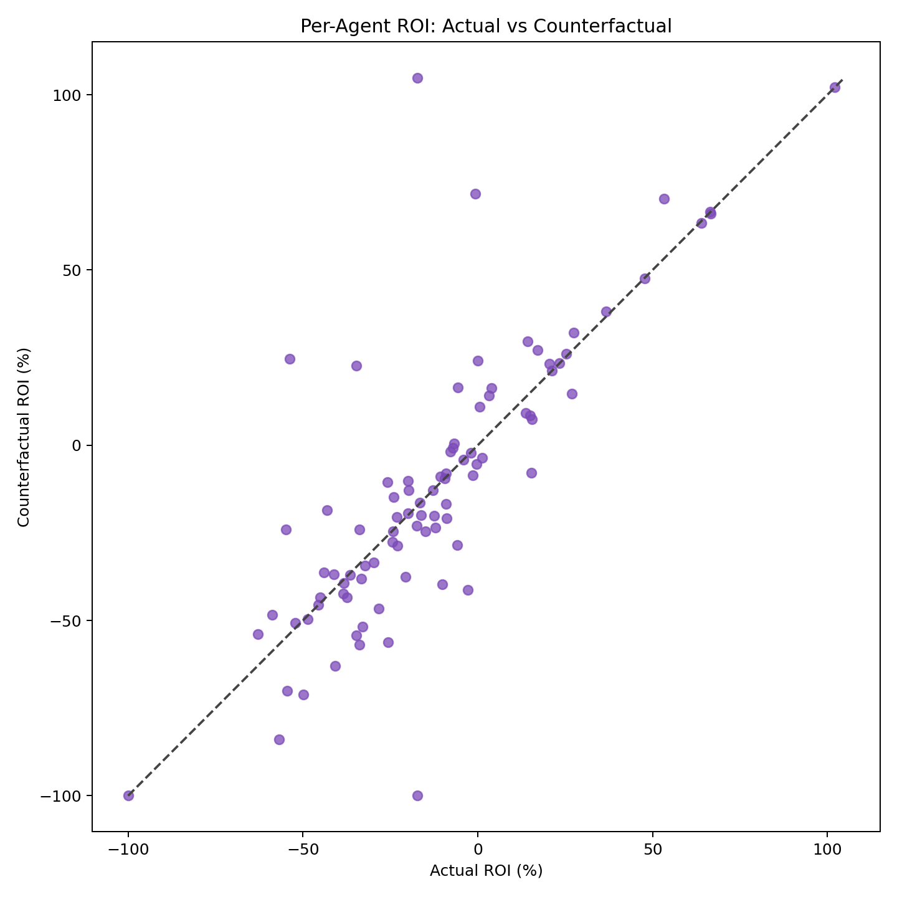
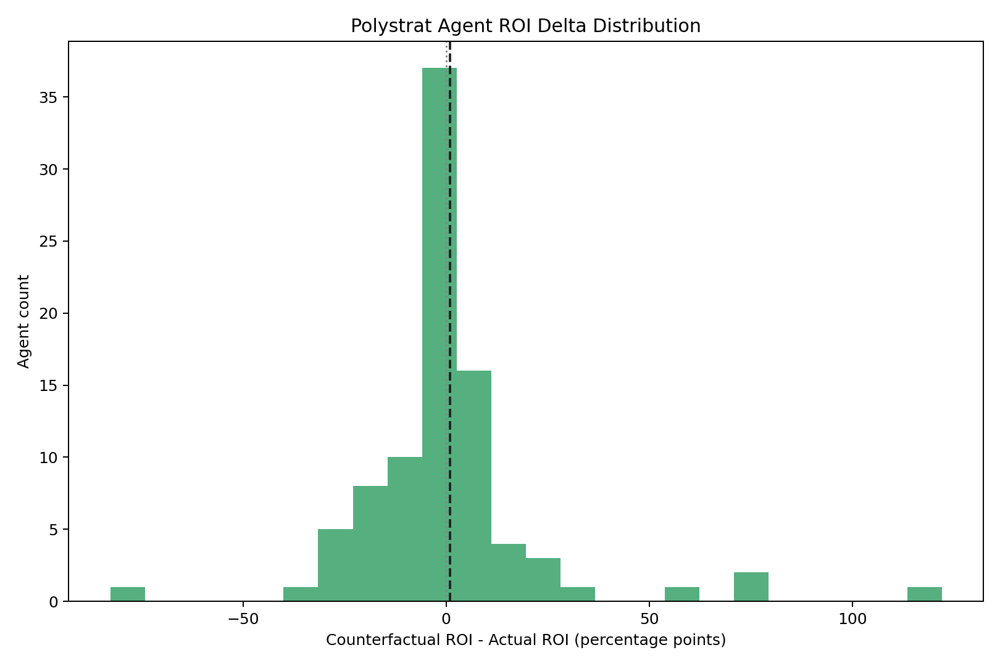
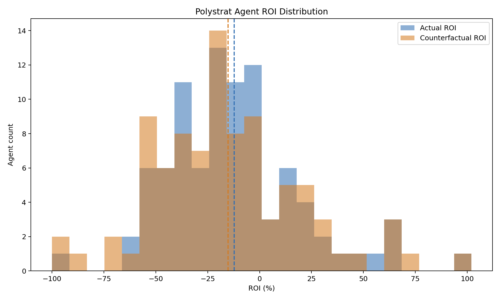
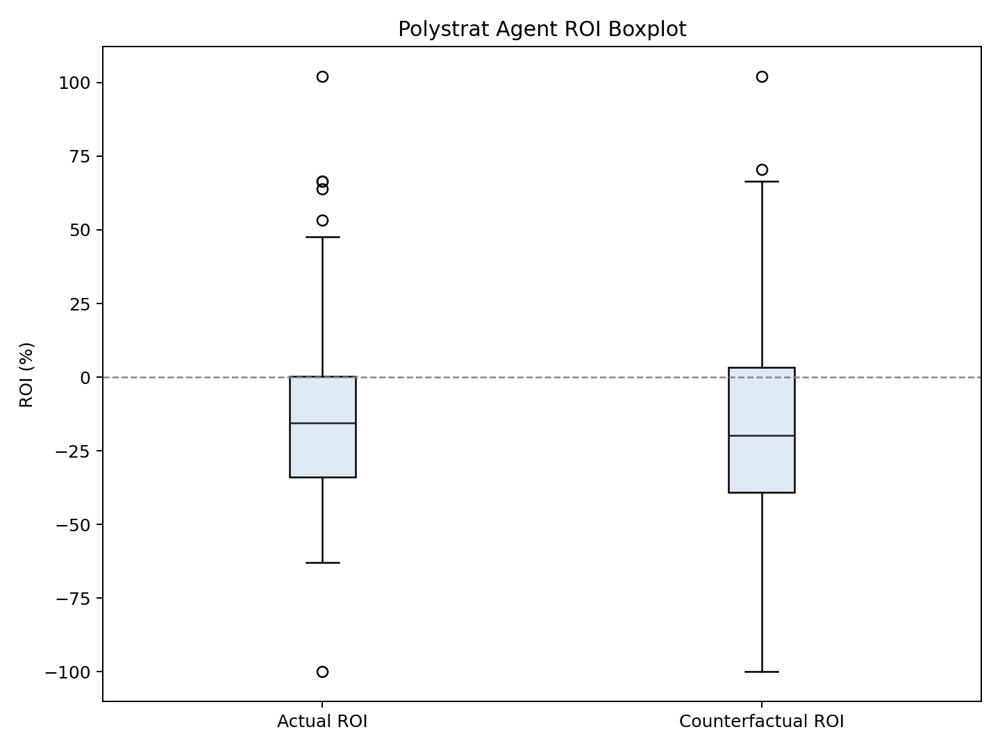
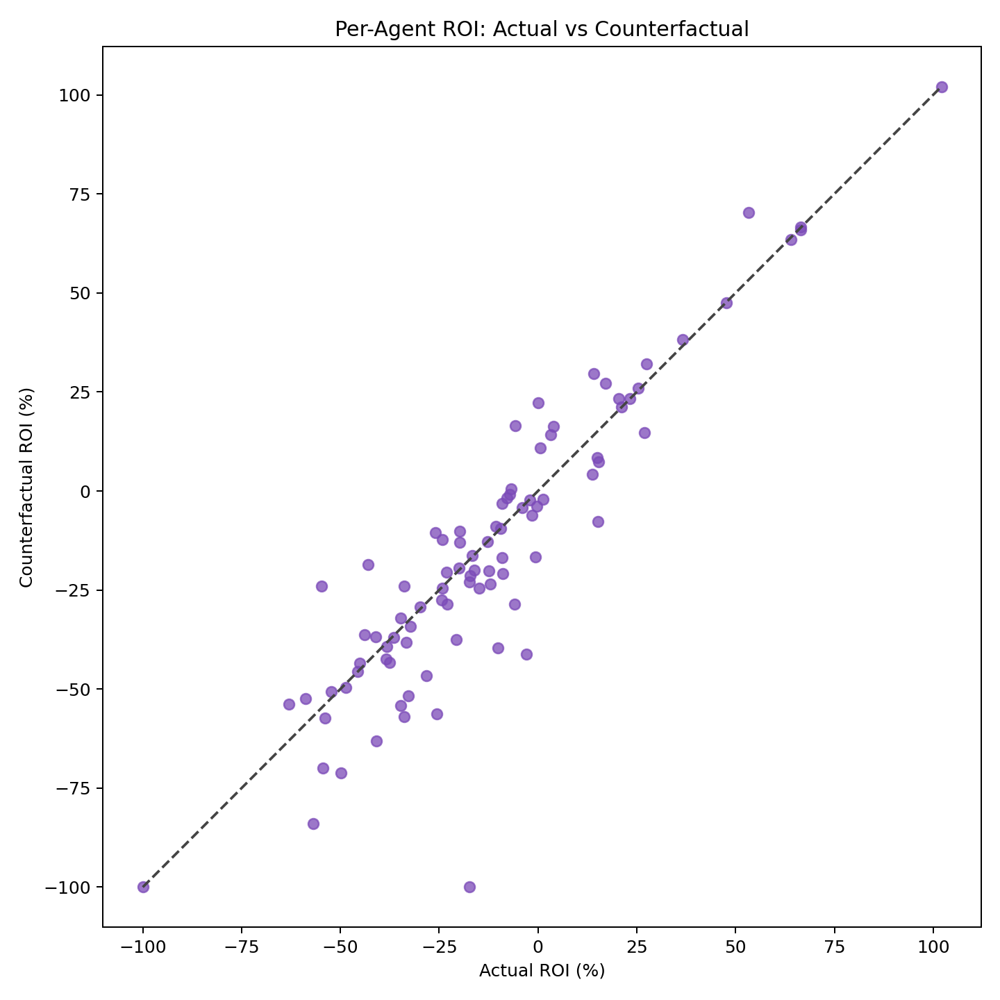
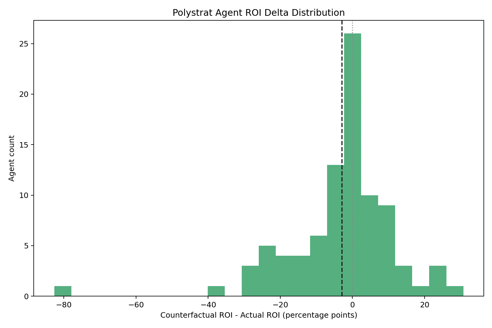

### Polystrat Kelly Replay v2 -- negRisk Segmentation (2026-03-20 to 2026-03-26)

**Date:** 2026-03-26
**Window:** Mar 03-20 to Mar 03-26
**Bets:** 1045 (902 negRisk, 143 non-negRisk)
**Source snapshot:** `polystrat_kelly_replay_2026-03-20_2026-03-26/snapshot.json`

---

#### Results

| mop | Segment | Bets | CF | YES | NO | Sw | Act ROI | CF ROI | Delta |
|-----|---------|------|----|-----|-----|-----|---------|--------|-------|
| 0.1 | all | 1045 | 858 | 138 | 720 | 20 | -15.1% | -9.65% | 5.45pp |
| 0.1 | negRisk | 902 | 740 | 97 | 643 | 3 | -14.36% | -17.56% | -3.2pp |
| 0.1 | non-negRisk | 143 | 118 | 41 | 77 | 17 | -20.26% | 41.19% | 61.45pp |
| 0.3 | all | 1045 | 841 | 127 | 714 | 3 | -15.1% | -17.76% | -2.66pp |
| 0.3 | negRisk | 902 | 739 | 96 | 643 | 2 | -14.36% | -17.51% | -3.15pp |
| 0.3 | non-negRisk | 143 | 102 | 31 | 71 | 1 | -20.26% | -19.5% | 0.75pp |
| 0.5 | all | 1045 | 838 | 124 | 714 | 0 | -15.1% | -18.07% | -2.97pp |
| 0.5 | negRisk | 902 | 737 | 94 | 643 | 0 | -14.36% | -17.69% | -3.33pp |
| 0.5 | non-negRisk | 143 | 101 | 30 | 71 | 0 | -20.26% | -20.7% | -0.44pp |

#### Key Questions

**Q1: Is Kelly doing better on negRisk?**
No. negRisk ROI delta: -3.2pp at mop=0.1, -3.33pp at mop=0.5. Kelly does not improve negRisk markets.

**Q2: Is Kelly doing better on non-negRisk? Does mop=0.5 help?**
At mop=0.1: delta=61.45pp (17 side switches). At mop=0.5: delta=-0.44pp (0 side switches).

---

#### Plots

##### min_oracle_prob = 0.1

##### min_oracle_prob = 0.5 (production)

---

#### Files

| File | Description |
|------|-------------|
| `snapshot_enriched.json` | Bets with `is_neg_risk` tags |
| `replay_mop_01.json` | Replay at mop=0.1 |
| `replay_mop_03.json` | Replay at mop=0.3 |
| `replay_mop_05.json` | Replay at mop=0.5 (production) |
| `segmented_mop_*.json` | negRisk-segmented statistics |
| `mop_*_plots/` | ROI distribution plots |

#### Methodology

Same as v2 Mar 12-26. See that report for full details.
Replay uses `polystrat_kelly_replay.py --input-snapshot`. negRisk tags from
`enrich_snapshot_neg_risk.py`. Segmentation via `segment_replay_by_neg_risk.py`.
