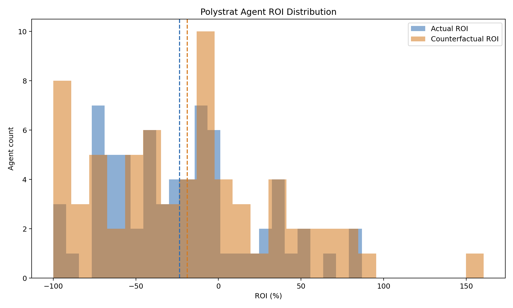
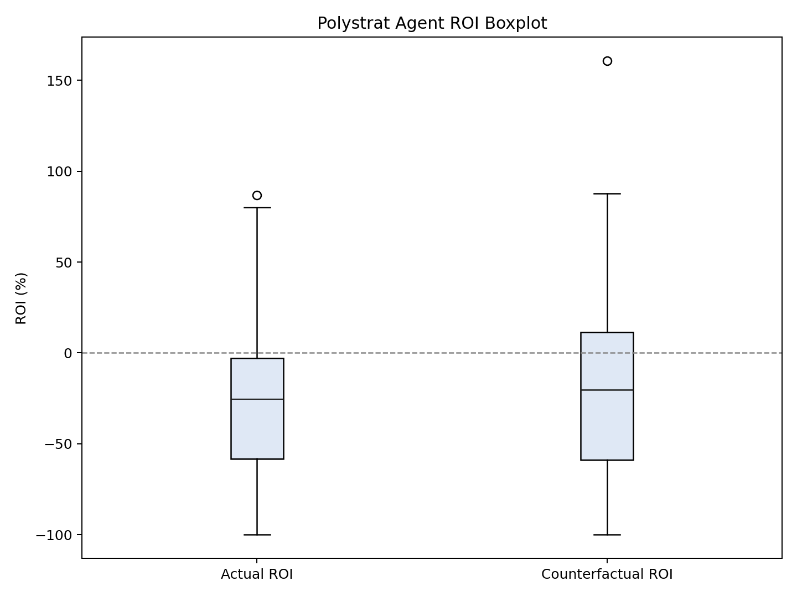
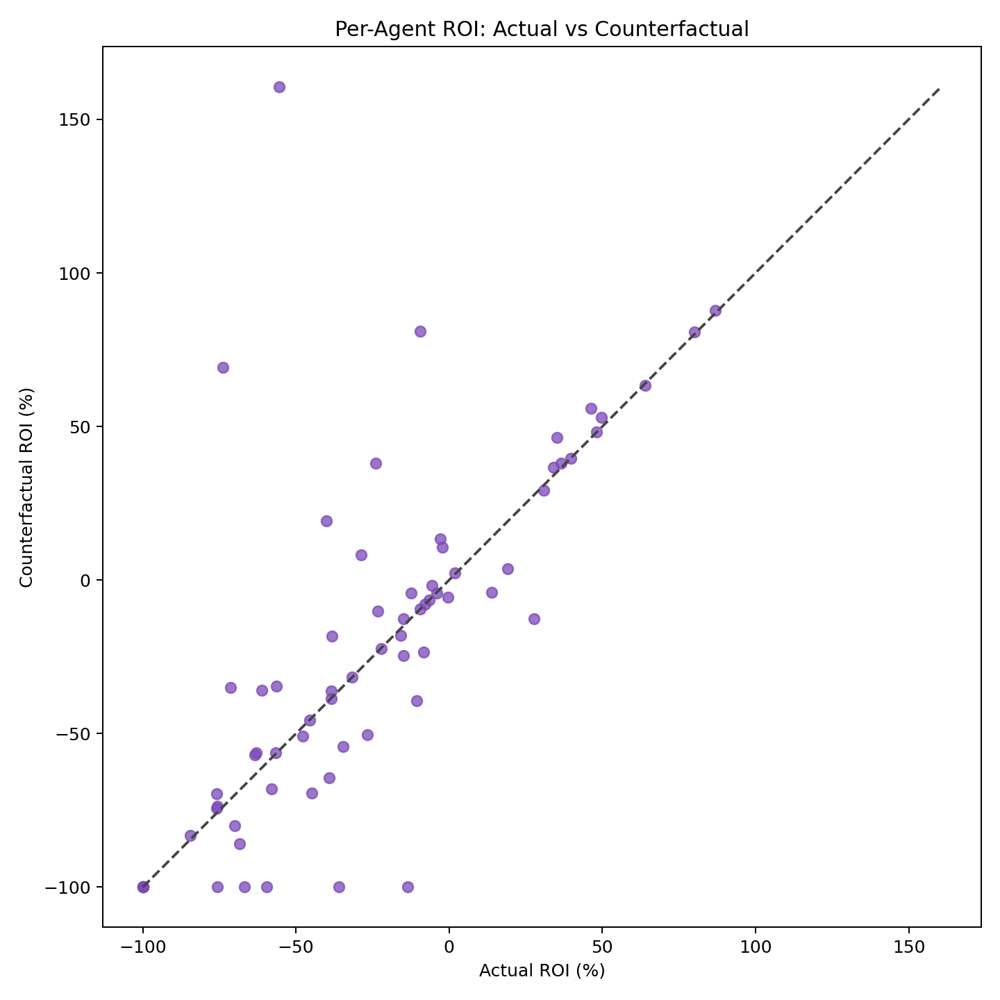
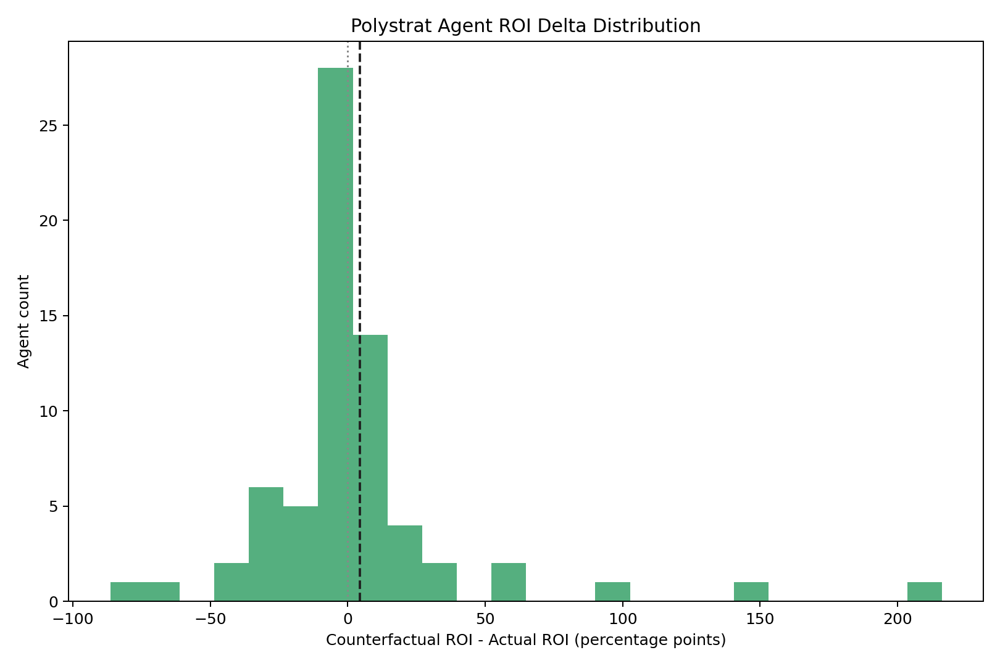
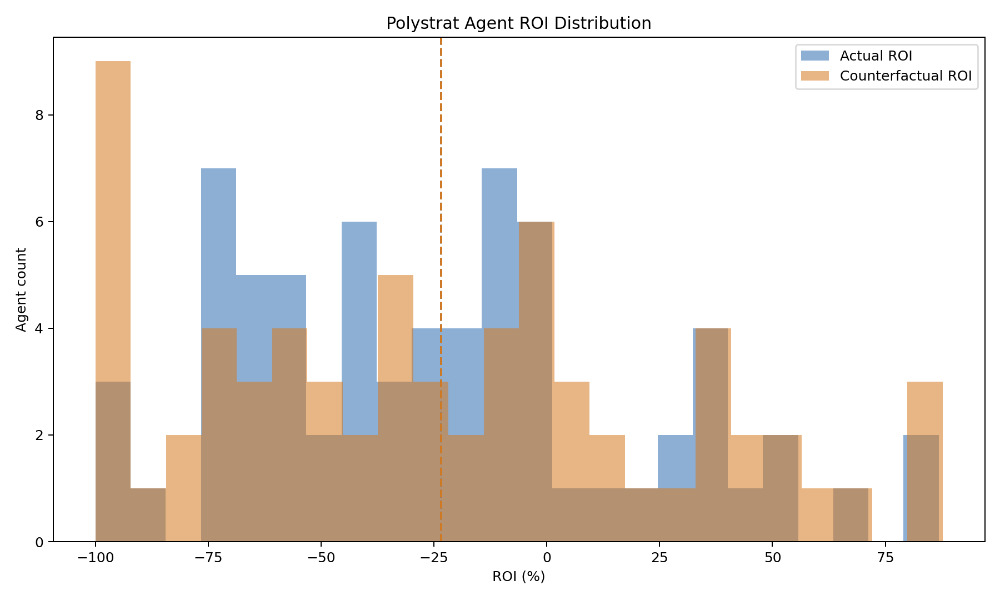
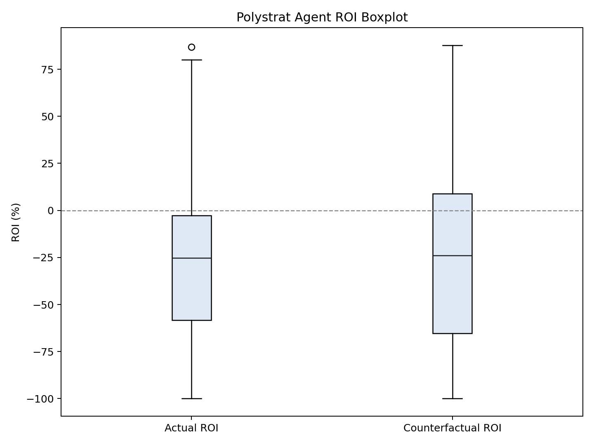
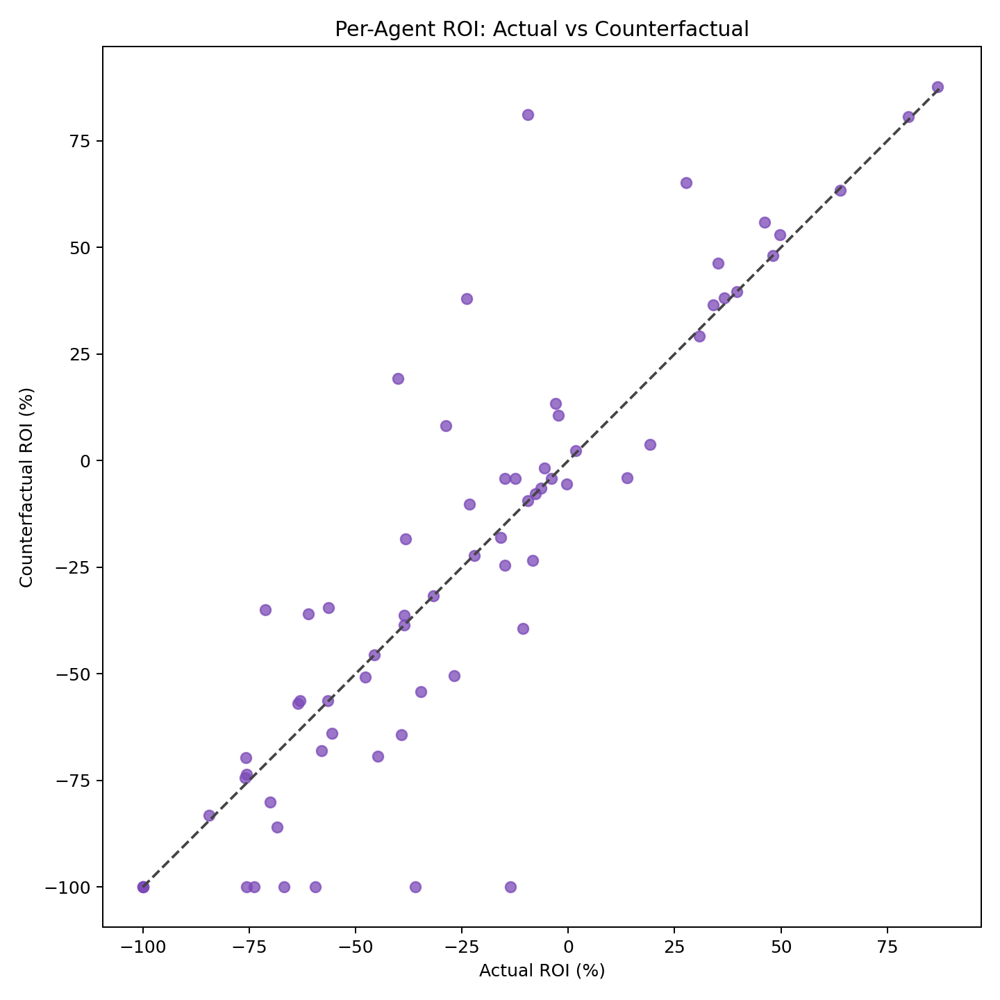
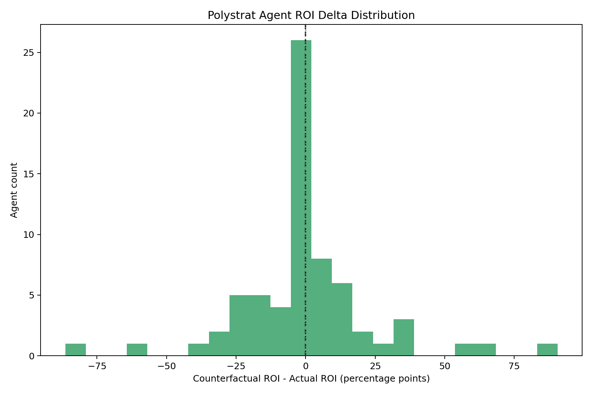

### Polystrat Kelly Replay v2 -- negRisk Segmentation (2026-03-23 to 2026-03-26)

**Date:** 2026-03-26
**Window:** Mar 03-23 to Mar 03-26
**Bets:** 315 (217 negRisk, 98 non-negRisk)
**Source snapshot:** `polystrat_kelly_replay_2026-03-23_2026-03-26/snapshot.json`

---

#### Results

| mop | Segment | Bets | CF | YES | NO | Sw | Act ROI | CF ROI | Delta |
|-----|---------|------|----|-----|-----|-----|---------|--------|-------|
| 0.1 | all | 315 | 266 | 41 | 225 | 8 | -26.7% | -19.14% | 7.56pp |
| 0.1 | negRisk | 217 | 180 | 15 | 165 | 0 | -30.55% | -29.36% | 1.19pp |
| 0.1 | non-negRisk | 98 | 86 | 26 | 60 | 8 | -17.91% | 1.85% | 19.76pp |
| 0.3 | all | 315 | 258 | 35 | 223 | 0 | -26.7% | -26.83% | -0.13pp |
| 0.3 | negRisk | 217 | 180 | 15 | 165 | 0 | -30.55% | -29.36% | 1.19pp |
| 0.3 | non-negRisk | 98 | 78 | 20 | 58 | 0 | -17.91% | -21.37% | -3.46pp |
| 0.5 | all | 315 | 258 | 35 | 223 | 0 | -26.7% | -26.83% | -0.13pp |
| 0.5 | negRisk | 217 | 180 | 15 | 165 | 0 | -30.55% | -29.36% | 1.19pp |
| 0.5 | non-negRisk | 98 | 78 | 20 | 58 | 0 | -17.91% | -21.37% | -3.46pp |

#### Key Questions

**Q1: Is Kelly doing better on negRisk?**
No. negRisk ROI delta: 1.19pp at mop=0.1, 1.19pp at mop=0.5. Kelly does not improve negRisk markets.

**Q2: Is Kelly doing better on non-negRisk? Does mop=0.5 help?**
At mop=0.1: delta=19.76pp (8 side switches). At mop=0.5: delta=-3.46pp (0 side switches).

---

#### Plots

##### min_oracle_prob = 0.1

##### min_oracle_prob = 0.5 (production)

---

#### Files

| File | Description |
|------|-------------|
| `snapshot_enriched.json` | Bets with `is_neg_risk` tags |
| `replay_mop_01.json` | Replay at mop=0.1 |
| `replay_mop_03.json` | Replay at mop=0.3 |
| `replay_mop_05.json` | Replay at mop=0.5 (production) |
| `segmented_mop_*.json` | negRisk-segmented statistics |
| `mop_*_plots/` | ROI distribution plots |

#### Methodology

Same as v2 Mar 12-26. See that report for full details.
Replay uses `polystrat_kelly_replay.py --input-snapshot`. negRisk tags from
`enrich_snapshot_neg_risk.py`. Segmentation via `segment_replay_by_neg_risk.py`.
