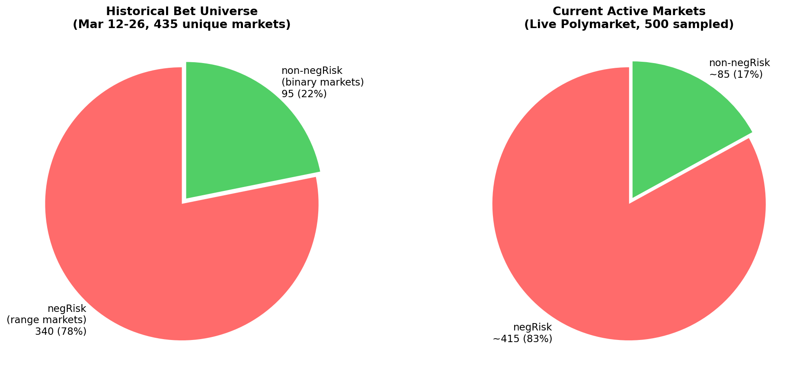
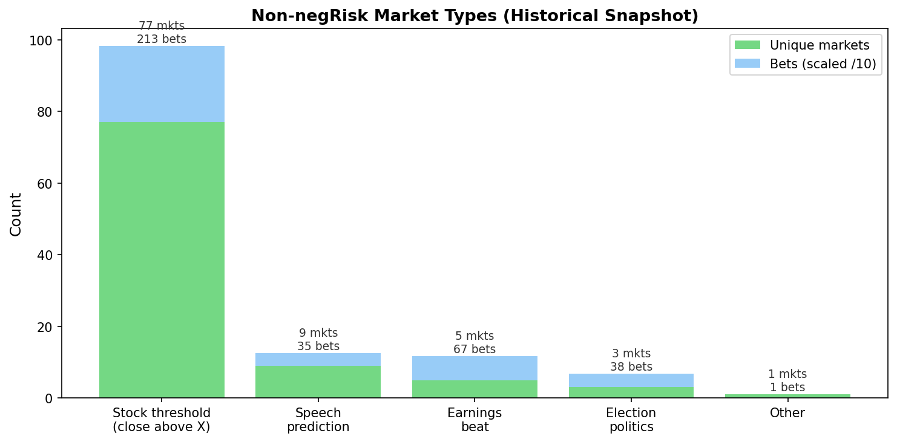
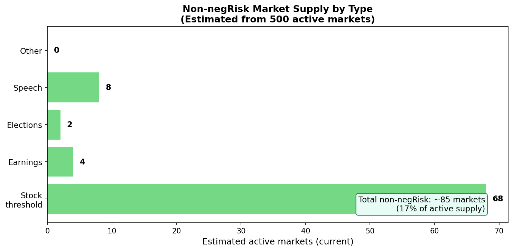
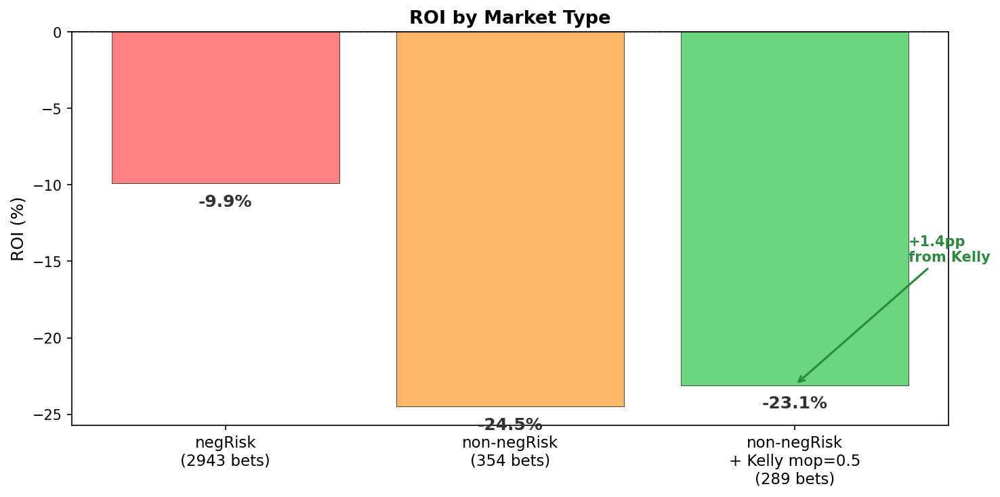

### Market Supply Analysis: Are There Enough Non-negRisk Markets?

**Date:** 2026-03-26
**Question:** If we filter negRisk markets, are there enough standalone binary
markets for the trader to bet on?

---

#### Current Market Supply (live Polymarket)

From 500 active markets sampled via Gamma API, with negRisk tagging from CLOB:

| | Historical (Mar 12-26) | Current (live) |
|--|----------------------|----------------|
| Total markets | 435 | ~500+ |
| negRisk (range) | 340 (78%) | ~415 (83%) |
| non-negRisk (binary) | 95 (22%) | **~85 (17%)** |

**There are approximately 85 non-negRisk binary markets active right now.**
This is a reasonable pool -- the trader evaluates ~10-20 markets per day, so
85 active markets provides 4-8 days of unique markets before recycling.

---

#### Non-negRisk Market Types

| Type | Markets | Bets (historical) | Agents |
|------|---------|-------------------|--------|
| Stock threshold (close above X) | 77 | 213 | 48 |
| Speech prediction | 9 | 35 | 23 |
| Earnings beat | 5 | 67 | 45 |
| Election/politics | 3 | 38 | 23 |
| Other | 1 | 1 | 1 |
| **Total** | **95** | **354** | -- |

Stock threshold markets ("Will AAPL close above 255?") dominate at 81% of
non-negRisk markets. These are true binary Yes/No markets (not split into
ranges), though they are related to stock price movements.

---

#### Estimated Current Supply by Type

Extrapolating from the snapshot proportions to the current 85 active non-negRisk:

| Type | Estimated active | Sufficient? |
|------|-----------------|-------------|
| Stock threshold | ~69 | Yes -- several per stock per day |
| Speech prediction | ~8 | Limited -- weekly events |
| Earnings beat | ~4 | Seasonal -- earnings season only |
| Election/politics | ~3 | Limited -- event-driven |
| Other | ~1 | Rare |

---

#### ROI by Market Type

| Segment | ROI | Note |
|---------|-----|------|
| negRisk (current) | -9.9% | Oracle has no edge |
| non-negRisk (current) | -24.5% | Oracle slightly better but still losing |
| non-negRisk + Kelly mop=0.5 | **-23.1%** | +1.4pp from Kelly bet sizing |

---

#### Is 85 Markets Enough?

**Yes, for the current trader throughput.** The trader evaluates 1 market per
cycle (~3-5 minutes), running 10-20 cycles per day. With 85 active non-negRisk
markets, the trader has enough supply for 4-8 days before needing to revisit
markets.

**However, the market diversity is limited.** 81% of non-negRisk markets are
stock-threshold markets from the same creator. This means:

- The trader would still bet heavily on stock-related markets
- Earnings and election markets are sparse (5-8 markets)
- True political/sports/event binary markets are rare in the current supply

**The real constraint is not market count but market diversity.** Filtering
negRisk removes the worst-performing segment (79% of losses) but does not
diversify the remaining pool. The trader would need access to broader market
categories (sports, geopolitics, crypto events) to achieve meaningful
diversification.

---

#### Recommendation

1. **Filter negRisk markets** -- removes 79% of losses, leaves ~85 markets
2. **The 85-market pool is sufficient** for current trader throughput
3. **Monitor market supply weekly** -- stock-threshold markets are created
   weekly; earnings markets are seasonal
4. **Consider expanding categories** if 85 proves insufficient -- sports
   and crypto categories have many non-negRisk binary markets
