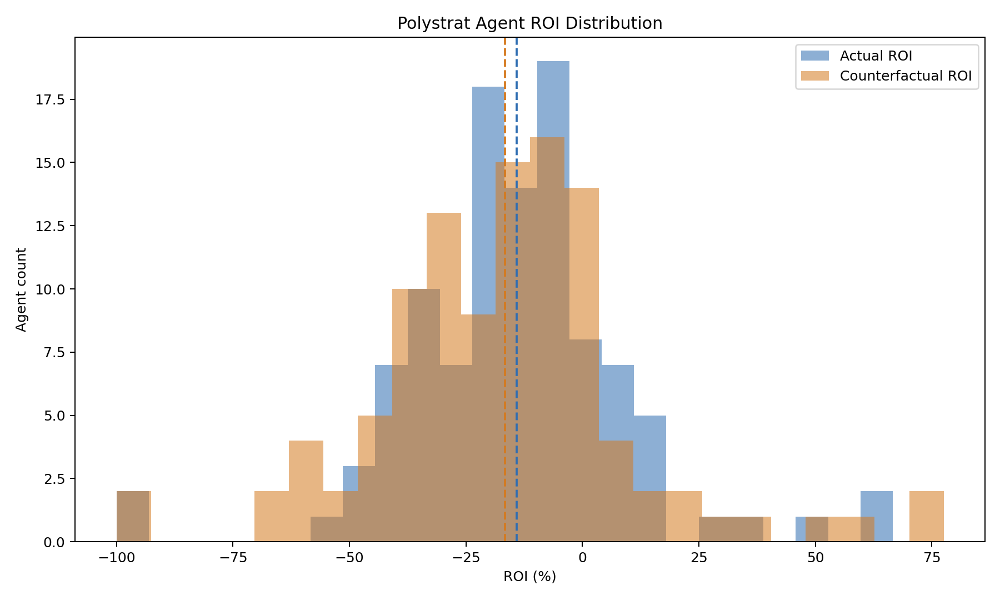
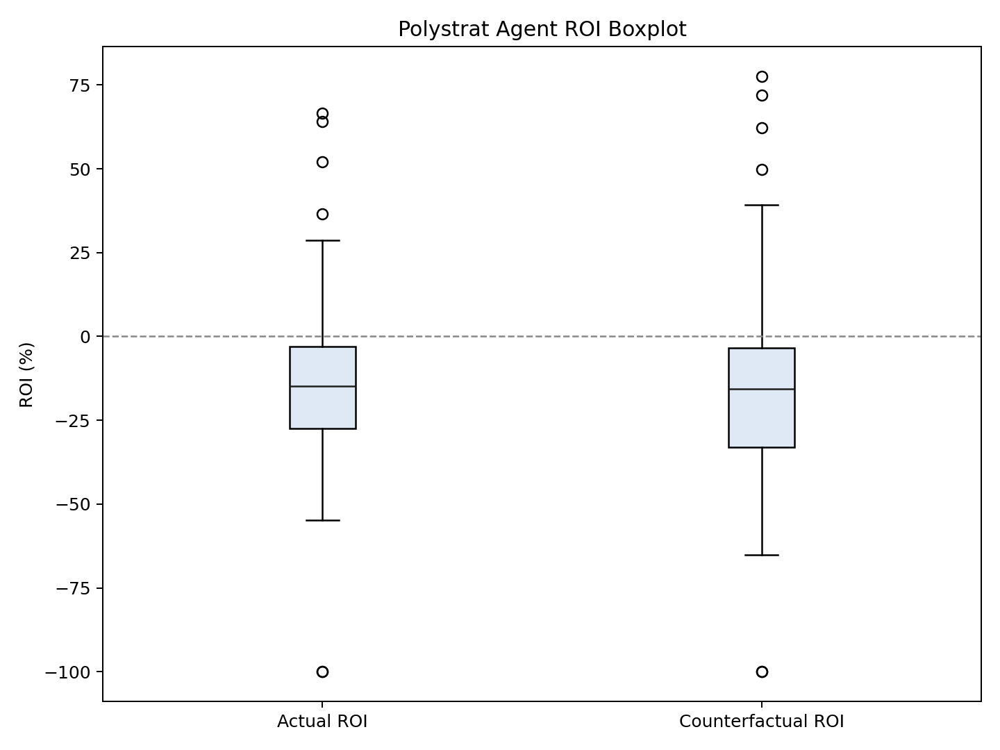
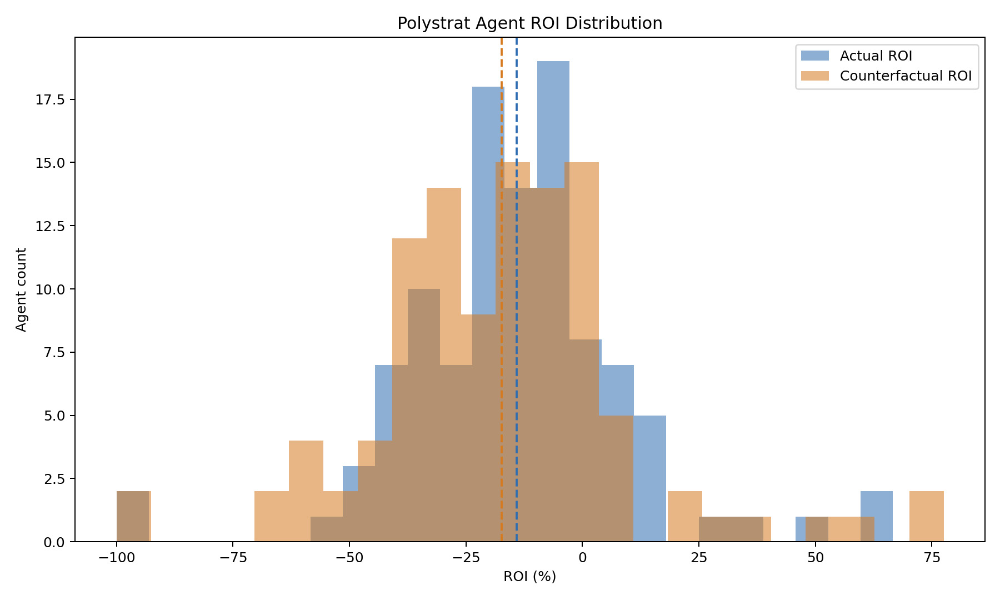

### Polystrat Kelly Replay v2b -- v1-Matching Parameters (2026-03-12 to 2026-03-26)

**Date:** 2026-03-26
**Window:** Mar 03-12 to Mar 03-26
**Bets:** 3297 (2943 negRisk, 354 non-negRisk)
**Parameters:** n_bets=1, max_bet=2.5, bankroll=15 (matching v1 exactly)

---

#### Results

| mop | Segment | Bets | CF | YES | NO | Sw | Act ROI | CF ROI | Delta |
|-----|---------|------|----|-----|-----|-----|---------|--------|-------|
| 0.1 | all | 3297 | 2364 | 329 | 2035 | 13 | -11.33% | -13.25% | -1.92pp |
| 0.1 | negRisk | 2943 | 2094 | 238 | 1856 | 6 | -9.9% | -13.03% | -3.13pp |
| 0.1 | non-negRisk | 354 | 270 | 91 | 179 | 7 | -24.49% | -14.81% | 9.68pp |
| 0.3 | all | 3297 | 2352 | 321 | 2031 | 1 | -11.33% | -14.31% | -2.99pp |
| 0.3 | negRisk | 2943 | 2089 | 233 | 1856 | 1 | -9.9% | -12.89% | -2.99pp |
| 0.3 | non-negRisk | 354 | 263 | 88 | 175 | 0 | -24.49% | -24.64% | -0.15pp |
| 0.5 | all | 3297 | 2351 | 320 | 2031 | 0 | -11.33% | -14.29% | -2.96pp |
| 0.5 | negRisk | 2943 | 2088 | 232 | 1856 | 0 | -9.9% | -12.86% | -2.96pp |
| 0.5 | non-negRisk | 354 | 263 | 88 | 175 | 0 | -24.49% | -24.64% | -0.15pp |

#### Plots

##### min_oracle_prob = 0.1

##### min_oracle_prob = 0.5 (production)

---

#### Files

| File | Description |
|------|-------------|
| `snapshot_enriched.json` | Bets with is_neg_risk tags |
| `replay_mop_*.json` | Full replays at mop=0.1, 0.3, 0.5 |
| `segmented_mop_*.json` | negRisk-segmented statistics |
| `mop_*_plots/` | ROI distribution plots |
