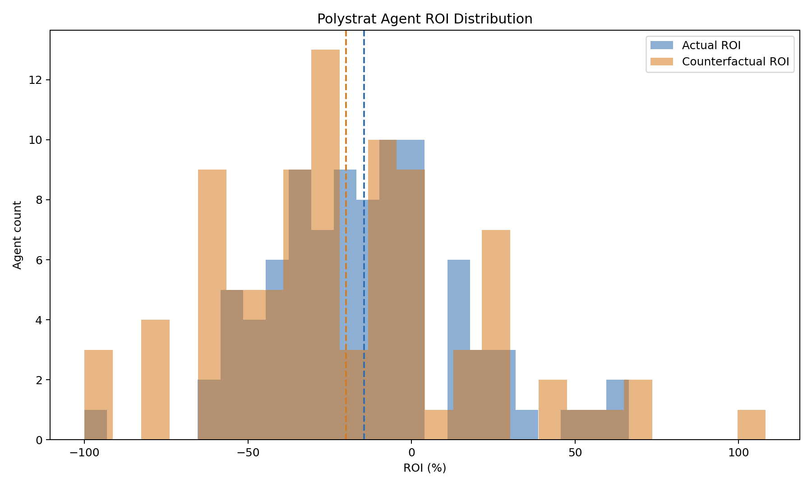
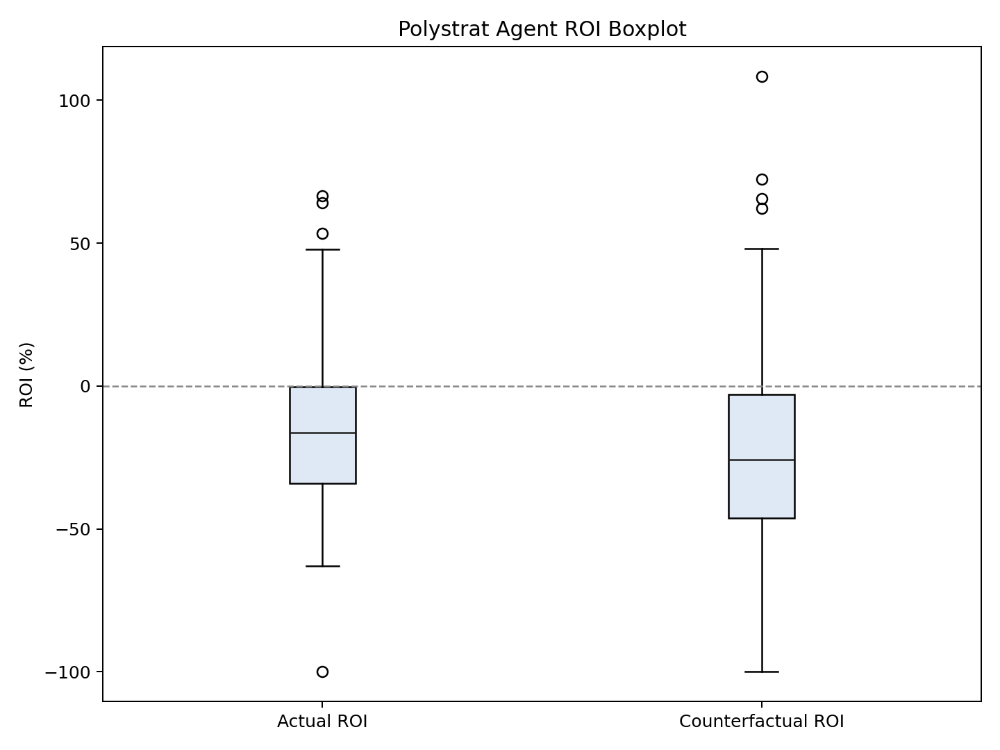
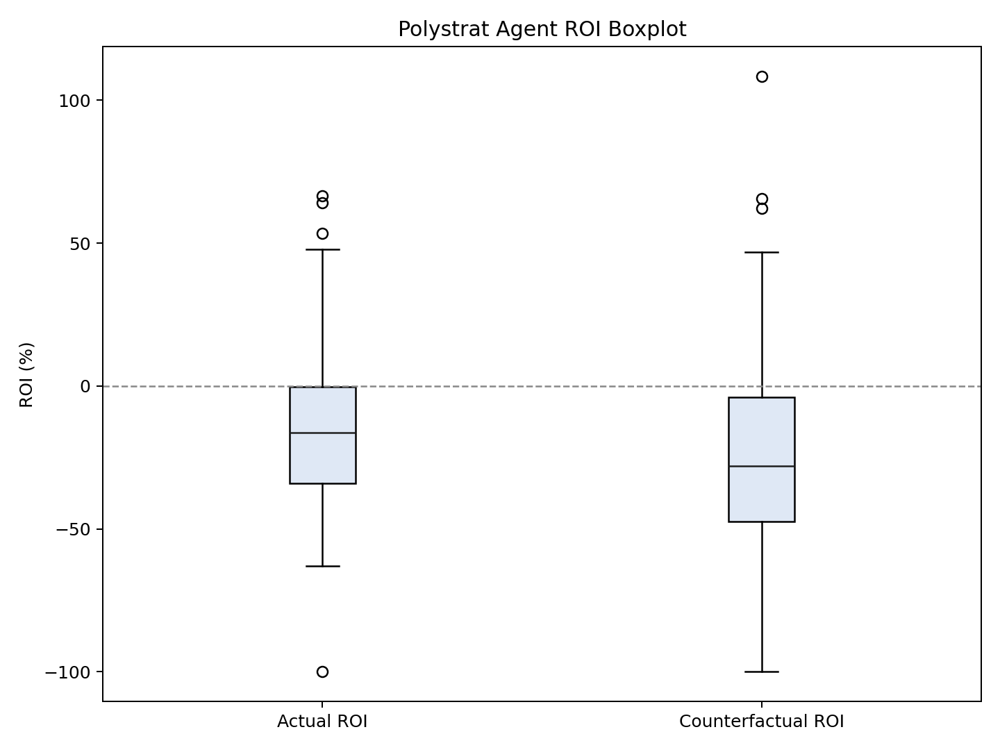

### Polystrat Kelly Replay v2b -- v1-Matching Parameters (2026-03-20 to 2026-03-26)

**Date:** 2026-03-26
**Window:** Mar 03-20 to Mar 03-26
**Bets:** 1045 (902 negRisk, 143 non-negRisk)
**Parameters:** n_bets=1, max_bet=2.5, bankroll=15 (matching v1 exactly)

---

#### Results

| mop | Segment | Bets | CF | YES | NO | Sw | Act ROI | CF ROI | Delta |
|-----|---------|------|----|-----|-----|-----|---------|--------|-------|
| 0.1 | all | 1045 | 727 | 102 | 625 | 5 | -15.1% | -19.88% | -4.78pp |
| 0.1 | negRisk | 902 | 630 | 75 | 555 | 0 | -14.36% | -24.09% | -9.73pp |
| 0.1 | non-negRisk | 143 | 97 | 27 | 70 | 5 | -20.26% | 3.66% | 23.92pp |
| 0.3 | all | 1045 | 722 | 100 | 622 | 0 | -15.1% | -24.1% | -9.0pp |
| 0.3 | negRisk | 902 | 630 | 75 | 555 | 0 | -14.36% | -24.09% | -9.73pp |
| 0.3 | non-negRisk | 143 | 92 | 25 | 67 | 0 | -20.26% | -24.15% | -3.9pp |
| 0.5 | all | 1045 | 722 | 100 | 622 | 0 | -15.1% | -24.1% | -9.0pp |
| 0.5 | negRisk | 902 | 630 | 75 | 555 | 0 | -14.36% | -24.09% | -9.73pp |
| 0.5 | non-negRisk | 143 | 92 | 25 | 67 | 0 | -20.26% | -24.15% | -3.9pp |

#### Plots

##### min_oracle_prob = 0.1

##### min_oracle_prob = 0.5 (production)

---

#### Files

| File | Description |
|------|-------------|
| `snapshot_enriched.json` | Bets with is_neg_risk tags |
| `replay_mop_*.json` | Full replays at mop=0.1, 0.3, 0.5 |
| `segmented_mop_*.json` | negRisk-segmented statistics |
| `mop_*_plots/` | ROI distribution plots |
