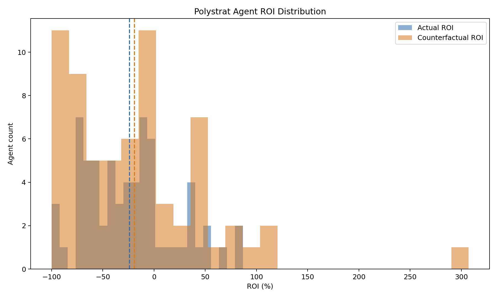
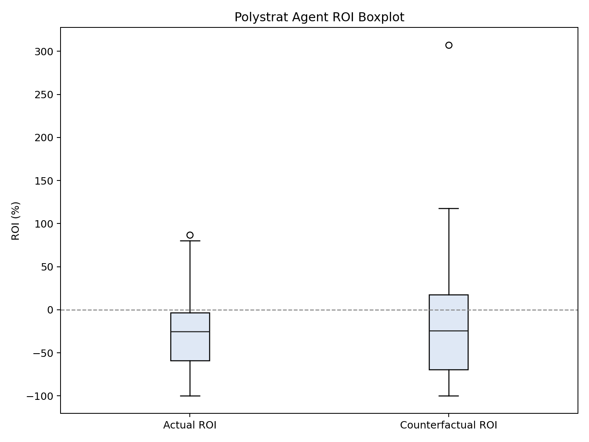
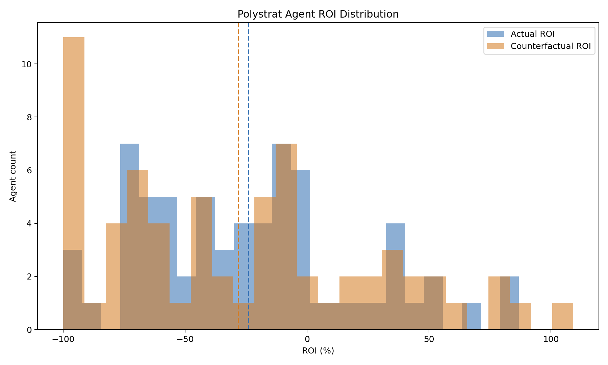
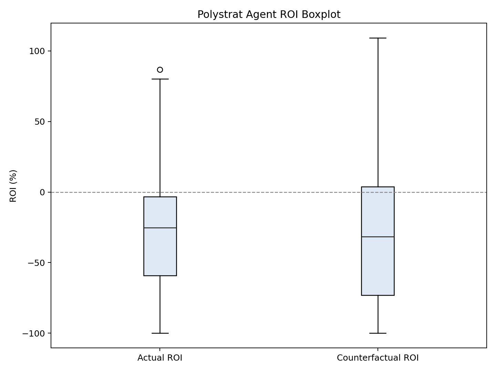

### Polystrat Kelly Replay v2b -- v1-Matching Parameters (2026-03-23 to 2026-03-26)

**Date:** 2026-03-26
**Window:** Mar 03-23 to Mar 03-26
**Bets:** 315 (217 negRisk, 98 non-negRisk)
**Parameters:** n_bets=1, max_bet=2.5, bankroll=15 (matching v1 exactly)

---

#### Results

| mop | Segment | Bets | CF | YES | NO | Sw | Act ROI | CF ROI | Delta |
|-----|---------|------|----|-----|-----|-----|---------|--------|-------|
| 0.1 | all | 315 | 243 | 33 | 210 | 4 | -26.7% | -19.39% | 7.31pp |
| 0.1 | negRisk | 217 | 162 | 11 | 151 | 0 | -30.55% | -35.31% | -4.76pp |
| 0.1 | non-negRisk | 98 | 81 | 22 | 59 | 4 | -17.91% | 7.73% | 25.64pp |
| 0.3 | all | 315 | 239 | 31 | 208 | 0 | -26.7% | -31.52% | -4.81pp |
| 0.3 | negRisk | 217 | 162 | 11 | 151 | 0 | -30.55% | -35.31% | -4.76pp |
| 0.3 | non-negRisk | 98 | 77 | 20 | 57 | 0 | -17.91% | -24.87% | -6.95pp |
| 0.5 | all | 315 | 239 | 31 | 208 | 0 | -26.7% | -31.52% | -4.81pp |
| 0.5 | negRisk | 217 | 162 | 11 | 151 | 0 | -30.55% | -35.31% | -4.76pp |
| 0.5 | non-negRisk | 98 | 77 | 20 | 57 | 0 | -17.91% | -24.87% | -6.95pp |

#### Plots

##### min_oracle_prob = 0.1

##### min_oracle_prob = 0.5 (production)

---

#### Files

| File | Description |
|------|-------------|
| `snapshot_enriched.json` | Bets with is_neg_risk tags |
| `replay_mop_*.json` | Full replays at mop=0.1, 0.3, 0.5 |
| `segmented_mop_*.json` | negRisk-segmented statistics |
| `mop_*_plots/` | ROI distribution plots |
